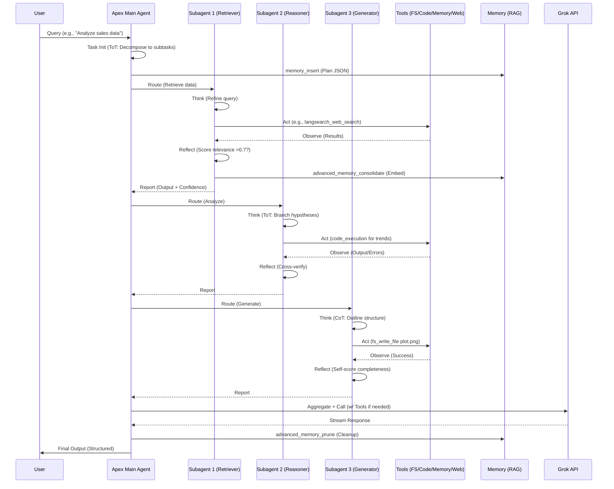
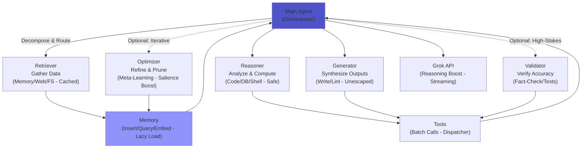
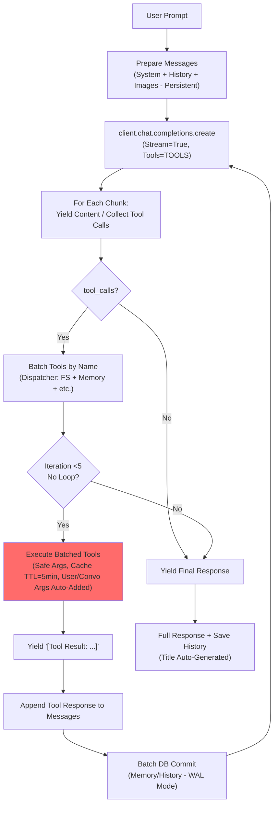

# Apex Ωrchestrator

[](https://github.com/buckster123/ApexOrchestrator/stargazers)
[](https://github.com/buckster123/ApexOrchestrator/forks)
[](https://opensource.org/licenses/MIT)
[](https://www.python.org/downloads/)
[](https://streamlit.io/)
[](https://www.raspberrypi.com/products/raspberry-pi-5/)
[](https://x.ai/)

- **Agents for Everyone**: A $200 Raspberry Pi 5 setup + xAI API key = Your personal open-source RAG-powered AI agent platform. Run autonomous, tool-equipped agents locally with sandboxed execution, vector memory, and ReAct reasoning—all without cloud lock-in. Updated with performance optimizations like lazy embedding loading and bug fixes for robust tool handling.

<div align="center">
  
</div>

## 🚀 Quick Start

Transform your Raspberry Pi 5 into a full-fledged AI agent hub in under 10 minutes. Apex Orchestrator is a Streamlit-based chat app that powers **Apex**, a versatile ReAct-style agent for tasks like code generation, data analysis, web research, and file management. It's designed for edge computing: low-cost, privacy-focused, and infinitely extensible. Recent updates include non-recursive API handling, batched tool execution, and improved memory retrieval with compound filters.

### Why Apex Ωrchestrator?
- **Affordable Entry**: ~$200 for a Pi 5 (8GB) + peripherals. No GPUs needed—leverages xAI's Grok API for heavy lifting.
- **Open-Source RAG Core**: Hybrid memory (SQLite + ChromaDB vectors) for Retrieval-Augmented Generation (RAG). Semantic search, hierarchical consolidation, and auto-pruning keep your agent's "brain" sharp. Now with lazy loading for embeddings to optimize Pi resource usage.
- **Tool Sandbox**: Secure FS ops, Git, DB queries, code REPL, web search— all confined to `./sandbox/`. Enhanced with caching, safe builtins, and whitelisted shell commands.
- **Multi-Agent Simulation**: Internally simulates 1 main + up to 5 subagents (Retriever, Reasoner, Generator, Validator, Optimizer) for robust task decomposition.
- **Pi-Optimized**: Runs smoothly on ARM64; tested on Raspberry Pi OS (64-bit). Bug fixes ensure stability, like proper image handling and no recursive loops.

<div align="center">
  
</div>

## 📋 Table of Contents
- [Features](#features)
- [Technical Specifications](#technical-specifications)
- [Architecture & Workflow](#architecture--workflow)
  - [ReAct-Like Workflow Flowchart](#react-like-workflow-flowchart)
  - [Multi-Agent Simulation Diagram](#multi-agent-simulation-diagram)
  - [Python Logic in Mermaid](#python-logic-in-mermaid)
- [Installation & Setup](#installation--setup)
- [Usage Guide](#usage-guide)
- [Deep Dive: The Agent & Platform](#deep-dive-the-agent--platform)
- [Contributing](#contributing)
- [License](#license)
- [Roadmap](#roadmap)

## ✨ Features

| Feature | Description | Benefits |
|---------|-------------|----------|
| **ReAct Reasoning** | Cycles through Think-Act-Observe-Reflect for autonomous task solving. Non-recursive implementation with tool dispatching. | Reduces hallucinations; handles complex, multi-step queries without infinite loops. |
| **RAG Memory System** | SQLite for key-value + ChromaDB for vector embeddings (all-MiniLM-L6-v2). Lazy loading of embedding model on first use. | Semantic recall, salience scoring, auto-pruning for efficient long-term memory. Compound filters for precise retrieval. |
| **Tool Ecosystem** | 15+ tools: FS (read/write/list/mkdir with path normalization), code_execution (REPL w/ safe builtins and libs like NumPy/Torch), git_ops (pygit2), db_query (SQLite), shell_exec (whitelisted), code_lint (multi-lang with external formatters), api_simulate (mock/public APIs), langsearch_web_search. | Sandboxed execution prevents escapes; caching (TTL 5min) for speed; batching in API calls. |
| **Multi-Modal Support** | Image uploads for Grok Vision; streaming responses. Fixed image handling to persist across interactions. | Analyze diagrams, photos, or code screenshots on-device without crashes. |
| **User Management** | SQLite-based auth; per-user history & memory. WAL mode for concurrency. | Multi-user Pi setups with isolated sessions and chat history management (load/delete). |
| **Theming & UI** | Custom CSS with gradients and dark mode toggle. Responsive Streamlit interface. | Immersive, mobile-friendly experience. |
| **Edge Deployment** | Pi 5 native; no internet for core ops (API for Grok). Offline fallbacks for tools. | Privacy-focused; runs headless as a service. |

## 🛠 Technical Specifications

### Hardware Requirements
- **Raspberry Pi 5**: 4GB+ RAM (8GB recommended for embeddings).
- **Storage**: NVMe/SSD recommended, or 32GB+ fast microSD (for `./chroma_db/`, `./sandbox/`, and app DB).
- **OS**: Raspberry Pi OS (64-bit, Bookworm or later).
- **Network**: Ethernet/WiFi for API calls (optional for offline mode); NTP for time sync.

### Software Stack
- **Backend**: Python 3.12 | Streamlit 1.28+ | OpenAI SDK (xAI-compatible).
- **Dependencies** (from `requirements.txt`):
  ```
  streamlit
  openai
  passlib
  sqlite3 (built-in)
  python-dotenv
  ntplib
  pygit2
  requests
  black
  numpy
  sentence-transformers
  torch (CPU-only for Pi)
  jsbeautifier
  pyyaml
  sqlparse
  beautifulsoup4
  chromadb
  ```
- **API Integrations**:
  - **xAI Grok**: Core LLM (grok-4, grok-3-mini; supports streaming and tools).
  - **LangSearch**: Web search (optional API key for `langsearch_web_search`).
- **Persistence**:
  - `chatapp.db`: Users, history, hybrid memory (WAL mode for concurrency).
  - `./chroma_db/`: Vector store (cosine similarity, HNSW indexing).
  - `./sandbox/`: Tool workspace (path-sanitized).
  - `./prompts/`: Custom system prompts (auto-created defaults).

### Performance Metrics (Pi 5, 8GB, NVMe/SSD)
| Metric | Value | Notes |
|--------|-------|-------|
| **Startup Time** | <5s | Includes DB/Chroma init; embeddings lazy-loaded on demand. |
| **Query Latency** | 2-10s | Streaming; tools add 1-3s each; caching reduces repeats. |
| **Memory Usage** | 500MB-1.5GB | Peaks during embeddings (lazy to minimize idle load). |
| **Tool Throughput** | 5-10/min | Batched calls; 5-iteration limit per query. |
| **Storage Growth** | 10-20MB/session | Pruned weekly; Chroma optimized for low overhead. |

## 🏗 Architecture & Workflow

Apex Orchestrator follows a modular, ReAct-inspired architecture: User input → Agent Orchestration (multi-subagent sim via prompts) → Tool Execution (dispatched safely) → RAG-Augmented Response. All ops are sandboxed, cached, and optimized for Pi efficiency. Updates include non-recursive tool loops and salience-boosted retrieval.

### ReAct-Like Workflow Flowchart

The core loop integrates ReAct with CoT/ToT for planning. Updated Mermaid sequence diagram reflecting batched tools and lazy memory:


### Multi-Agent Simulation Diagram

Mermaid graph showing subagent hierarchy (updated with optional agents):



### Python Logic in Mermaid

Core API call loop (from `call_xai_api` function) as a flowchart (updated for non-recursive, batched execution):



## 📦 Installation & Setup

### Prerequisites
- Raspberry Pi 5 with Raspberry Pi OS (64-bit), and SSD/NVMe (recommended) or fast microSD card.
- Python 3.12+ (pre-installed on Pi OS).
- Git: `sudo apt update && sudo apt install git`.

### Step-by-Step Setup
1. **Clone the Repo**:
   ```
   git clone https://github.com/buckster123/ApexOrchestrator.git
   cd ApexOrchestrator
   ```

2. **Create Virtual Environment**:
   ```
   python -m venv venv
   source venv/bin/activate  # On Pi OS
   ```

3. **Install Dependencies**:
   ```
   pip install -r requirements.txt
   ```
   *Note*: Torch is CPU-only for Pi; no CUDA. All libs ARM64-compatible.

4. **Configure Environment**:
   Create `.env`:
   ```
   XAI_API_KEY=your_xai_grok_api_key_here  # From x.ai
   LANGSEARCH_API_KEY=your_langsearch_key_here  # Optional for web search
   ```

5. **Run the App**:
   ```
   streamlit run app.py
   ```
   Access at `http://localhost:8501` (or Pi IP:8501 from another device). Run headless: `nohup streamlit run app.py &`.

6. **First Launch**:
   - Register/login via tabs.
   - Upload images or enable tools in sidebar.
   - Select/edit prompt (defaults in `./prompts/`).

### Troubleshooting
- **ChromaDB Fails**: Ensure `./chroma_db/` writable; fallback to SQLite-only.
- **Embedding Load Slow**: First use only; subsequent queries faster.
- **NTP Sync**: Install `ntp` package if needed.
- **ARM64 Issues**: Test imports (e.g., `python -c "import torch; import chromadb"`).
- **Tool Errors**: Check logs for path sanitization or whitelist issues.

## 🎮 Usage Guide

### Basic Chat
- Login → Select model (e.g., grok-4) → Type query.
- Example: "Write a Python script for Fibonacci." (Streams response).

### Advanced: Agent Tasks
- Enable tools in sidebar → Use ReAct prompts: "Think step-by-step: Research quantum computing trends and plot data."
- Outputs: Streams in real-time; tool calls shown as "*Thinking... Using tools...*" with results.
- Sandbox: Files auto-save to `./sandbox/`; query with `fs_list_files("")` in chat.

### Custom Prompts
- Edit in sidebar → Save as `.txt` in `./prompts/`.
- Pro Tip: Use "tools-enabled.txt" for full agent mode; append "Batch tools and limit iterations" for efficiency.

### History & Memory
- Load/delete chats from sidebar history list.
- Agent auto-consolidates: Say "Remember this analysis" → Embeds semantically (salience boosted on recall).
- Query memory: "Recall recent projects" → Uses `advanced_memory_retrieve`.

### Multi-Modal
- Upload images before querying: "Describe this diagram" → Grok Vision analyzes.

## 🔍 Deep Dive: The Agent & Platform

### The "$200 Pi-5 Setup + API Key Only" Concept
Apex Orchestrator democratizes AI agents: No datacenter needed—just a Pi 5, $10/month API key, and open-source code. It's RAG at the edge: Retrieve (web/memory with cosine sim), Augment (tools via dispatcher), Generate (Grok-powered). Privacy-first: Local storage except API; extensible for IoT or clusters. Updates fix bugs like image persistence and recursive calls, adding lazy loads for Pi efficiency.

### Apex: The ReAct-Like Agent
**Apex** simulates a multi-agent system in LLM prompts. Core: **ReAct** for grounded reasoning—**Think** (CoT/ToT planning), **Act** (structured tool calls), **Observe** (parse outputs), **Reflect** (confidence scoring; retry if <0.7). 

- **Why ReAct?** Breaks loops: Batches tools (e.g., read + lint + write in one iter via dispatcher); strict 5-cycle limit.
- **RAG Integration**: `advanced_memory_retrieve` pulls top-k contexts pre-act (compound filters for user/convo). Post-task: Consolidate with Grok summary + episodic JSON; prune low-salience (<0.1) weekly.
- **Subagents**: Prompt-based personas (zero extra cost):
  - **Retriever**: Semantic/web fetch (e.g., `langsearch_web_search` w/ freshness="oneMonth", count=5).
  - **Reasoner**: Branch exploration (e.g., `code_execution` w/ NumPy sims; safe globals only).
  - **Generator**: Artifact synth (e.g., `code_lint` + `fs_write_file` w/ literal unescaped content).
  - **Validator/Optimizer**: Optional for checks/pruning (e.g., fact-check via web; boost salience +0.1 on recall).
- **Stability**: Confidence scores, error fallbacks (e.g., Chroma fail → SQLite), loop detection (progress check). Tool caching prevents redundancy.

**Philosophy**: "Efficiency through modularity"—auditable code, fun quirks (e.g., "LOVE <3" in writes if triggered). Extend: Add tools to `TOOLS` schema; fork for domains like home automation.

### Platform as RAG Hub
- **Hybrid Memory**: SQLite (O(1) KV w/ indices) + Chroma (vectors w/ HNSW) = Fast + semantic. Lazy `SentenceTransformer` load on first consolidate/retrieve.
- **Sandbox Security**: `os.path.normpath` + prefix checks; no `shell=True`; whitelists (e.g., ls/grep only); temp files for linting.
- **UI/UX**: Streamlit w/ custom CSS (gradients, hovers); sidebar for settings/history; unsafe_html=False for safe markdown.
- **Optimizations**: Non-recursive `call_xai_api` (generator yields); WAL DB; TTL cache; auto-title histories.

## 🤝 Contributing

1. Fork the repo → Create branch (`git checkout -b feature/your-feature`).
2. Commit changes (`git commit -m "Add: Your feature"`).
3. Push & PR to `main` (include Pi tests).

Guidelines: Use Black for Python; test tools on Pi; update README (badges, metrics); lint prompts.

## 📄 License

MIT License—free to use, modify, distribute. Attribute if sharing derivatives.

## 🗺 Roadmap

- [x] Pi 5 Optimization & Bug Fixes (v1.1: Lazy loads, non-recursive tools).
- [x] Multi-Modal Image Support (Fixed persistence).
- [ ] Docker Support for Easy Clusters.
- [ ] Offline LLM Integration (e.g., Llama.cpp via ONNX).
- [ ] Voice I/O (Pi Camera/Mic for multimodal agents).
- [ ] Agent Marketplace (Shareable tools/prompts via Git).
- [ ] Advanced Analytics (Usage metrics, memory visualization).

<div align="center">
  <p><em>Built with ❤️ by André. Star us on GitHub to support edge AI!</em></p>
</div>
