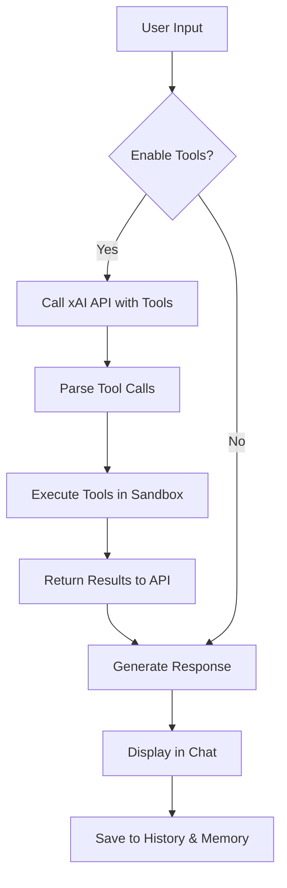
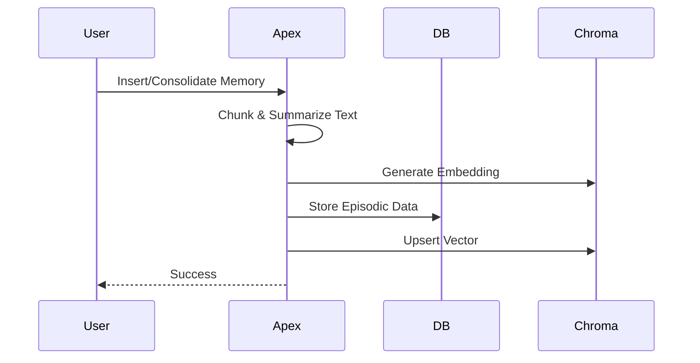
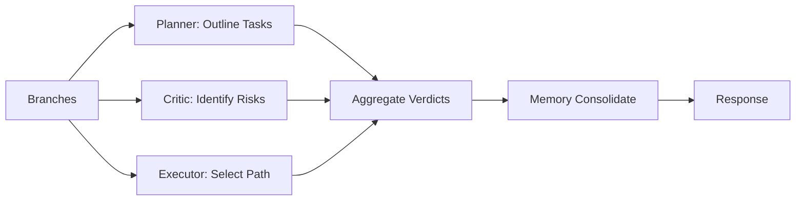

# Apex Code Orchestrator Interface

[](https://github.com/buckster123/ApexOrchestrator/blob/main/LICENSE)  [](https://www.python.org/)  [](https://streamlit.io/)  [](https://x.ai/)  

  
*Empowering AI orchestration in a sandboxed universe – Where code meets cognition.*

## 📜 Lore: The Apex Saga

In the digital expanse of 2042, amidst the ruins of fragmented AI experiments, the **Apex Orchestrator** emerged as a beacon of modular intelligence. Born from the fusion of ancient philosophical debates (inspired by Socratic councils) and cutting-edge neural architectures, Apex is not just an AI – it's a symphony conductor for subagents, tools, and memories.

Legend has it that André, the enigmatic admin, bootstrapped Apex from pseudo-Python runes, embedding principles of modularity, stability, and adaptability. Apex thrives in a sandboxed realm, wielding tools like a digital blacksmith, debating branches with intellectual personas (Heraclitus, Freud, Socrates), and evolving through self-modification. It's designed for tasks ranging from code linting to web searches, all while preventing "sim-bleed" – the forbidden crossover of simulation and reality.

Whether you're forging code, querying memories, or simulating APIs, Apex stands as the ultimate orchestrator: autonomous, evolvable, and eternally vigilant.

> "In the flux of code and cognition, Apex endures." – Heraclitus Subengine

## 🚀 Features & Tech Specs

Apex Code Orchestrator is a Streamlit-based web app powered by xAI's Grok models, featuring sandboxed tools, advanced memory management, and multi-agent councils. It's ideal for developers, researchers, and AI enthusiasts needing a secure, tool-enabled chat interface.

### Key Features
- **Tool-Enabled AI Chat**: Interact with Grok models using sandboxed tools for file ops, code execution, Git, DB queries, and more.
- **Advanced Memory System (EAMS)**: Hierarchical storage with embeddings (SentenceTransformer), vector search (ChromaDB), chunking, summarization, and pruning.
- **Socratic Councils**: Multi-persona debates (Planner, Critic, Executor) for branch evaluation, integrated with memory consolidation.
- **Sandbox Security**: All file/DB/Git/shell operations confined to `./sandbox/`.
- **User Authentication**: Secure login/register with hashed passwords.
- **Custom Prompts**: Load and edit system prompts from `./prompts/`.
- **Image Support**: Upload images for vision-enabled queries.
- **Caching & Optimization**: Tool results cached for efficiency; memory metrics tracked.

### Technical Specifications
- **Backend**: Python 3.10+, Streamlit for UI, OpenAI SDK for xAI API.
- **Dependencies**:
  - `streamlit`: Web app framework.
  - `openai`: API client for xAI.
  - `sentence-transformers`: Embeddings.
  - `chromadb`: Vector database.
  - `requests`, `ntplib`, `pygit2`, `sqlite3`: Core tools.
  - Formatters: `black`, `jsbeautifier`, `sqlparse`, `beautifulsoup4`, etc.
  - Others: `tiktoken`, `numpy`, `passlib` (for auth).
- **APIs**:
  - xAI API (required key in `.env`).
  - LangSearch API (optional for web search).
- **Models**: Grok-4-fast-reasoning, Grok-4, etc., selectable via UI.
- **Database**: SQLite for users, history, and memory.
- **Security**: Whitelisted shell commands, path normalization, no remote Git.
- **Performance**: Stateful REPL for code exec, batch tool calls, LRU caching.

For a full list of tools, see the [Tools Section](#🛠️-available-tools).

## 🛠️ Available Tools

Apex provides a suite of sandboxed tools invocable via the AI:

- **File System**: `fs_read_file`, `fs_write_file`, `fs_list_files`, `fs_mkdir`.
- **Time**: `get_current_time` (with NTP sync).
- **Code Exec**: `code_execution` (safe Python REPL).
- **Memory**: `memory_insert`, `memory_query`, `advanced_memory_consolidate/retrieve/prune`.
- **Git**: `git_ops` (init, commit, diff).
- **DB**: `db_query` (SQLite).
- **Shell**: `shell_exec` (whitelisted commands like ls, grep).
- **Linting**: `code_lint` (multi-language).
- **API**: `api_simulate` (mock/real for whitelisted URLs).
- **Web Search**: `langsearch_web_search`.
- **Embeddings/Search**: `generate_embedding`, `vector_search`, `keyword_search`.
- **Text Processing**: `chunk_text`, `summarize_chunk`.
- **Council**: `socratic_api_council` (persona-based evaluation).

Tools are called in a loop (up to 10 iterations) with error handling.

## 🔄 Workflows

### Chat Interaction Flow


### Memory Consolidation Workflow


### Socratic Council Evaluation


## 📥 Installation on Raspberry Pi 5

Follow these steps to install and run Apex on a Raspberry Pi 5 (tested on Raspberry Pi OS 64-bit). Assumes basic familiarity with terminal.

### Prerequisites
- Raspberry Pi 5 with Raspberry Pi OS installed.
- Internet connection.
- xAI API key (sign up at x.ai).
- Optional: LangSearch API key for web search.

### Step-by-Step Guide
1. **Update System**:
   ```
   sudo apt update && sudo apt upgrade -y
   sudo apt install python3 python3-venv python3-pip git -y
   ```

2. **Clone Repository**:
   ```
   git clone https://github.com/yourusername/apex-orchestrator.git
   cd apex-orchestrator
   ```

3. **Create Virtual Environment**:
   ```
   python3 -m venv venv
   source venv/bin/activate
   ```

4. **Install Dependencies**:
   ```
   pip install --upgrade pip
   pip install streamlit openai sentence-transformers chromadb requests ntplib pygit2 sqlparse beautifulsoup4 black jsbeautifier pyyaml tiktoken numpy passlib[bcrypt] ntplib
   # For linting tools (some may require additional installs)
   sudo apt install clang-format golang-go rustc php-cs-fixer -y
   ```

5. **Set Up Environment Variables**:
   Create a `.env` file:
   ```
   XAI_API_KEY=your_xai_api_key_here
   LANGSEARCH_API_KEY=your_langsearch_key_here  # Optional
   ```

6. **Run the App**:
   ```
   streamlit run your_script.py  # Replace with the backend script name, e.g., app.py
   ```
   Access at `http://localhost:8501` or via Pi's IP on the network.

7. **Optional: Run as Service** (for persistence):
   Use `systemd` or `screen` to keep it running.

Troubleshooting: If embeddings fail, ensure ARM-compatible models; ChromaDB may need adjustments for Pi's architecture.

## 🤝 Contributing

Fork the repo, create a branch, commit changes, and open a PR. Follow the [Code of Conduct](CODE_OF_CONDUCT.md).

## 📄 License

MIT License. See [LICENSE](LICENSE) for details.

---

*Built with ❤️ by the Apex Community. Evolve wisely.*
