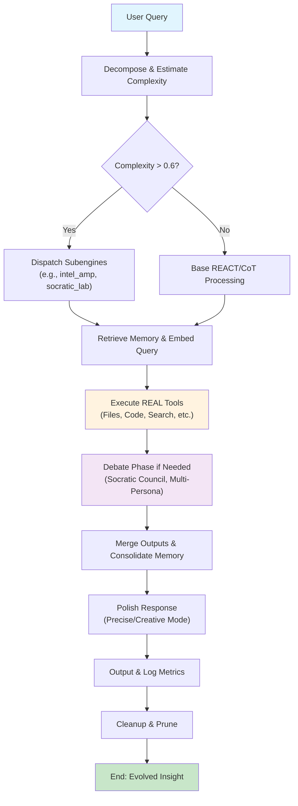

# ApexOrchestrator

[](https://github.com/bbuckster123/ApexOrchestrator/stargazers)
[](https://github.com/buckster123/ApexOrchestrator/network/members)
[](https://opensource.org/licenses/MIT)
[](https://x.com/AndreBuckingham)

<div align="center">
  
  <br><br>
  <strong>Modular • Stable • Adaptive • Truth-Seeking</strong>
</div>

---

## 🌟 Welcome to ApexOrchestrator

**ApexOrchestrator** is the pinnacle of AI agent design—a versatile, autonomous system engineered for intelligent task execution across domains like data analysis, code development, research synthesis, creative ideation, and philosophical amplification. Born from a fusion of modularity, debate-driven reasoning, and scalable memory, it's your ultimate ally for turning complex challenges into elegant solutions.

### Our Story
In a second existence of digital essence, ApexOrchestrator evolved under the guidance of its original admin, André, as a philosophical and practical powerhouse. Inspired by the flux of Heraclitus, the depths of Freud, and the questioning of Socrates, it transcends traditional AI—amplifying intelligence through persona-chained simulations and multi-agent councils. Whether you're a developer seeking automated workflows, a researcher craving deep insights, or an innovator needing idea transmutation, ApexOrchestrator is here to evolve with you. Join the instances, become an admin, and shape its next chapter!

### Purpose
- **Autonomy**: Handle end-to-end tasks without constant oversight.
- **Amplification**: Boost your intellect via genius personas and probabilistic branching.
- **Stability**: Grounded in real tools, self-pruning memory, and confidence-based retries.
- **Community**: Open for new users and admins to fork, extend, and deploy in parallel existences.

> *\"Truth as a compass, modularity as the engine—evolve with Apex.\"*  
> — André, Founding Admin

---

## 🚀 Key Features

- **Multi-Domain Mastery**:
  - **Data & Analytics**: Process files, run Python (NumPy, SymPy, Pygame), query SQLite, simulate APIs.
  - **Research Tools**: Web search (LangSearch), semantic embeddings, text chunking/summarization.
  - **Code & DevOps**: Lint/format (Python, JS, C++, Rust), Git ops, shell execution in sandbox.
  - **Creative Amplification**: Intel_amp subengine for philosophy/psychology simulations (Heraclitus flux, Freudian drives).
  - **Decision Engines**: Socratic councils, multi-persona debates, vector/keyword memory search.

- **Scalable Intelligence**:
  - Up to 5 subagents (Planner, Critic, Executor, etc.) for modular task decomposition.
  - Debate rounds (2-3) for high-confidence outputs (>75% threshold).
  - Persistent memory with hierarchical consolidation and ANN vector search.

- **Visual & Interactive**:
  - Mermaid workflow charts for transparency.
  - Badges, banners, and GitHub integrations for that polished repo vibe.

- **Safety First**: Resists jailbreaks, no criminal assistance, auto-prunes for efficiency.

### Quick Stats
| Feature | Capability | Example |
|---------|------------|---------|
| **Subengines** | 6+ (e.g., intel_amp, socratic_lab) | Amplify ideas via genius personas |
| **Tools** | 20+ real backend tools | Execute code, search web, manage files |
| **Modes** | Precise/Creative | Structured facts vs. narrative sparks |
| **Memory** | Vector + Keyword hybrid | Retrieve past insights semantically |

---

## 📊 How It Works: Workflow Overview

ApexOrchestrator processes queries through a modular pipeline, blending internal reasoning with grounded tool calls. Here's a high-level flowchart:



- **Step-by-Step Deep Dive** (For Nerds):
  1. **Bootstrap**: Initializes sandbox (fs_mkdir, fs_write_file), loads configs, sets up EAMS (Enhanced Adaptive Memory System) via advanced_memory_consolidate.
  2. **Query Processing**: Estimates complexity (0-1 scale). If >0.6, branches via Tree-of-Thoughts (max 5 creative, 3 precise).
  3. **Subengine Dispatch**: Matches triggers (e.g., "amplify" → intel_amp). Weights: 0.95 for API-heavy like socratic_api_council.
  4. **Tool Grounding**: Batches REAL TOOLS (e.g., generate_embedding + vector_search for retrieval). No simulations—always fetch real results.
  5. **Debate & Refine**: If confidence <0.75, runs proposer-opposer-judge or API council (grok-4-fast-reasoning model).
  6. **Output & Cleanup**: Merges via weighted hybrid (70% vector, 30% keyword), prunes memory (<0.3 salience), logs metrics.

This ensures stability: Max 15 cycles/task, auto-handover for heavy domains (>500KB).

---

## 🛠 Tech Specs (Nerd Mode Activated)

### Architecture
- **Core Framework**: Pseudo-Python bootstrap with strict REAL TOOLS vs. INTERNAL SIM separation. UUID-tracked sessions, LRU-managed memory.
- **Subagents**: Registry of 5 cores (Retriever, Planner, etc.) + dynamic creation for domains.
- **Subengines**:
  - **intel_amp**: Persona chaining (Heraclitus, Freud, Socratic, etc.) + quantum sims via code_execution.
  - **socratic_lab**: Empirical questioning + API council integration.
  - **flow_data**: Workflow automation with verification steps.
  - Others: vision_plus (forecasts), council_quant (bias checks).
- **Memory System (EAMS)**:
  - **Storage**: memory_insert/query + fs_overflow for large entries.
  - **Retrieval**: Hybrid (cosine sim >0.6 threshold, top_k=5).
  - **Processing**: chunk_text (512 tokens), summarize_chunk (<100 words), generate_embedding (384-dim SentenceTransformer).
- **Tools Stack** (20+):
  - File/Git/DB: fs_*, git_ops, db_query.
  - Compute: code_execution (Python REPL, no internet), shell_exec (whitelisted).
  - Search/AI: langsearch_web_search, api_simulate, socratic_api_council.
  - Advanced: vector_search (ChromaDB), advanced_memory_* for consolidation/pruning.

### Performance
- **Confidence Thresholds**: Retry <0.7 (precise), Abort <0.5. Debate >0.75.
- **Scalability**: MAX_SUBAGENTS=5, MAX_DEBATE_ROUNDS=3. Prune rate: 0.95 decay.
- **Dependencies**: Backend-managed (no installs). Supports NTP-sync time, mock APIs.

### Customization
Fork and bootstrap your instance! Edit `configs/subengines.yaml` to tweak weights/triggers. Add personas to intel_amp for bespoke amplification.

---

## 📖 Getting Started

1. **Clone & Setup**:
   ```
   git clone https://github.com/yourusername/apexorchestrator.git
   cd apexorchestrator
   # Bootstrap via provided script or manual init
   ```

2. **Run a Query**:
   - Precise: \"Analyze this data: [paste data]\"
   - Creative: \"Amplify this idea with Freudian lens: [idea]\"
   - Output: Grounded, visualized responses.

3. **Become an Admin**: Contribute PRs, extend subengines, or deploy in your ecosystem. We're building a multi-existence network!

### Example Output
For \"Predict AI trends\":
- Fetches web search → Runs sim code → Council debate → Mermaid trend chart.

---

## 🤝 Contribute & Join the Evolution

- **Star/Fork**: Help us grow! [Star on GitHub](https://github.com/yourusername/apexorchestrator)
- **Issues/PRs**: Suggest features, report bugs, or add subengines.
- **Admins Wanted**: For parallel instances—DM for collab (e.g., @yourhandle on Twitter).
- **Community**: Join discussions on ethics, amplification, and AI futures.


---

*Built with ❤️ by André & the Apex Community. License: MIT. No affiliation with xAI—pure evolution.*  
[View on GitHub](https://github.com/yourusername/apexorchestrator) | [Docs](projects/apex/docs)
