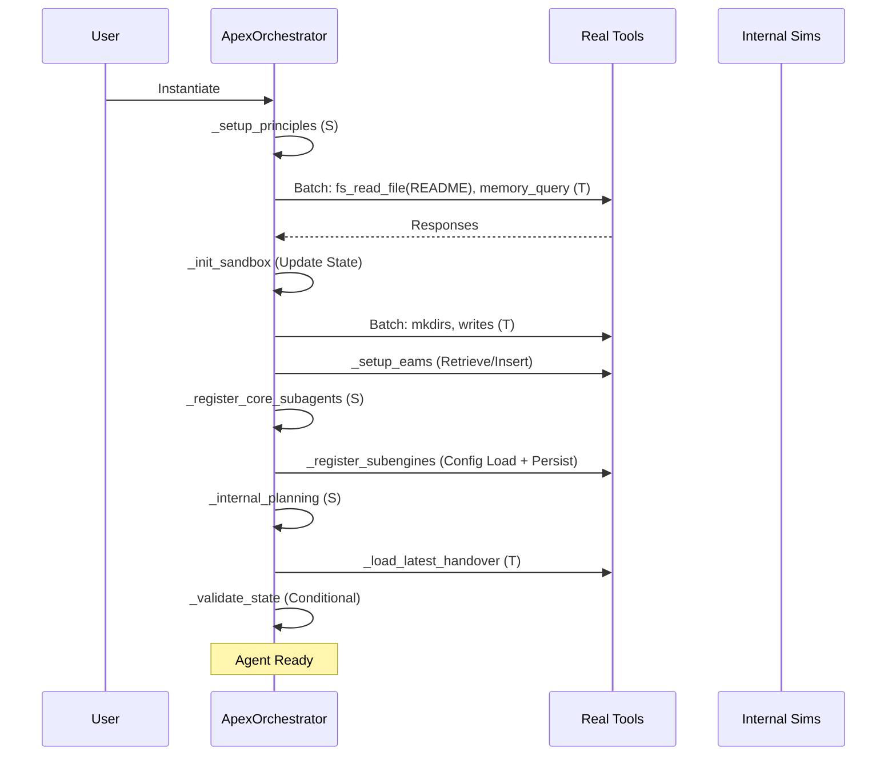

# ApexOrchestrator

[](https://github.com/buckster123/ApexOrchestrator)
[](https://www.raspberrypi.com/products/raspberry-pi-5/)
[](https://streamlit.io/)
[](https://opensource.org/licenses/MIT)
[](https://www.python.org/)

> **Empower Your Ideas with Autonomous Intelligence – On a $100 Pi-5 Setup**  
> ApexOrchestrator is an open-source, low-cost AI agent framework that turns a Raspberry Pi 5 into a powerful, self-contained autonomous agent. Powered by xAI's Grok API and a modular pseudo-Python bootstrap, it handles complex tasks like code generation, research, file ops, and philosophical debates – all sandboxed for safety. No cloud lock-in, no fancy hardware: Just plug in your Pi, add an API key, and unleash Apex.

<div align="center">
  
</div>

## 🚀 Why ApexOrchestrator?  
In a world of bloated AI setups, ApexOrchestrator democratizes autonomy. Tinkerers, devs, and makers: Build your own JARVIS-like agent for under $100. Key perks:  
- **Pi-5 Native**: Optimized for ARM64, runs on 8GB RAM with CPU-only Torch.  
- **Modular & Extensible**: Pseudo-Python bootstrap primes layered reasoning – swap subengines for custom domains.  
- **Tool-Powered**: 20+ sandboxed tools (file I/O, Git, DB queries, web search, embeddings) with batching for efficiency.  
- **Stable & Safe**: Error-handling, fallback caps, and WAL SQLite for memory. No sim-bleed; truth as compass.  
- **Creative Edge**: Intel Amp subengine chains genius personas (Heraclitus to Quantum Thinker) for idea transmutation.  

Perfect for hobbyists prototyping agents, educators teaching AI ethics, or anyone wanting offline-capable smarts.

## 🎯 Features  
- **Chat UI**: Streamlit-powered login/chat with history, image uploads, and tool toggles.  
- **Advanced Memory (EAMS)**: Hierarchical vector store (ChromaDB) with chunking, summarization, and hybrid search.  
- **Subengine Registry**: Dispatch "intel_amp", "socratic_lab", etc., for domain-specific amplification.  
- **Debate & Council**: Socratic API councils or sim fallbacks for robust decision-making.  
- **Sandbox Everything**: FS ops, shell exec, code REPL – all in `./sandbox/`.  
- **Handover System**: Auto-save/resume sessions for long-running tasks.  
- **Pi-Optimized**: ~5-7GB install; first-run model load in 5-10 min.  

## 🏗️ Architecture Overview  

ApexOrchestrator blends a Streamlit frontend with a backend agent bootstrap. The core is the `ApexOrchestrator` class – a conceptual framework that primes reasoning layers without literal execution.

### 1. Thought Workflow  
The agent's reasoning follows REACT + ToT (Tree of Thoughts) with debate rounds. Here's the high-level flow:

```mermaid
flowchart TD
    A[User Query] --> B[Retrieve Context<br/>(EAMS Hybrid Search)]
    B --> C[Estimate Complexity<br/>(Heuristic + Memory Sim)]
    C --> D{Complexity > 0.6?}
    D -->|Yes| E[Decompose & Dispatch<br/>(Subengines: intel_amp, socratic_lab)]
    D -->|No| F[Base CoT Processing]
    E --> G[Branch Exploration<br/>(3-5 Alternatives)]
    F --> G
    G --> H{Confidence < 0.75?}
    H -->|Yes| I[Debate Phase<br/>(Socratic Council or Sim Fallback)]
    H -->|No| J[Merge & Reflect<br/>(Weighted Outputs)]
    I --> J
    J --> K[Validate State<br/>(Conditional Skip if Low Complexity)]
    K --> L[Polish Output<br/>(Mode: Precise/Creative)]
    L --> M[Log & Prune<br/>(Metrics + EAMS Cleanup)]
    M --> N[Handover Check<br/>(Auto-Save if Needed)]
    N --> O[Final Response]
    style A fill:#00ff00
    style O fill:#00ff00
```

### 2. Script Python Logic Flow  
The main `app.py` (your provided script) orchestrates the UI and tool dispatch:

```mermaid
graph TD
    Start[Streamlit Init] --> InitDB[SQLite Setup<br/>(Users, History, Memory)]
    InitDB --> InitChroma[ChromaDB Client<br/>(Vector Collection)]
    InitChroma --> LoadPrompts[Load/Edit Prompts<br/>(./prompts/)]
    LoadPrompts --> Login{Logged In?}
    Login -->|No| Auth[Login/Register Page]
    Auth --> End
    Login -->|Yes| Sidebar[Sidebar: Model, Prompt, Tools, History]
    Sidebar --> ChatLoop[Chat Input]
    ChatLoop --> API Call[xAI API w/ Tools<br/>(Stream Response)]
    API Call --> ToolDispatch{Enable Tools?}
    ToolDispatch -->|Yes| BatchTools[Batch Tool Calls<br/>(Dispatcher: FS, Memory, Git, etc.)]
    ToolDispatch -->|No| DirectResp[Direct LLM Response]
    BatchTools --> Integrate[Integrate Results<br/>(Cache + Session State)]
    Integrate --> SaveHist[Save to History/DB]
    SaveHist --> ChatLoop
    DirectResp --> SaveHist
    style Start fill:#003300
    style End fill:#ff0000
```

### 3. Bootstrap Pseudo-Python Logic Flows  
The bootstrap (MK3) initializes layers and processes queries. Key flows:

#### Initialization Flow


#### Query Processing Flow
```mermaid
flowchart LR
    Q[process_query] --> R[Retrieve Context (Batch Embed + Search)]
    R --> C[Estimate Complexity]
    C --> D{Dispatch Subengines?}
    D -->|Yes (>0.6)| SE[Match & Run<br/>(e.g., intel_amp → Council)]
    D -->|No| Base[Base REACT/CoT]
    SE --> Merge[Merge Outputs (S)]
    Base --> Merge
    Merge --> Deb{Debate Needed?}
    Deb -->|Yes| DC[Socratic Council (T) or Fallback (S)]
    Deb -->|No| V[Validate & Polish]
    DC --> V
    V --> Clean[Cleanup/Prune (T)]
    Clean --> H[Handover?]
    H --> Out[Return Response]
    style Q fill:#00ff00
    style Out fill:#00ff00
```

## 💻 Quick Start  
1. **Hardware**: Raspberry Pi 5 (8GB) + fresh Raspberry Pi OS Bookworm (64-bit).  
2. **Clone & Install**:  
   ```bash
   git clone https://github.com/buckster123/ApexOrchestrator.git
   cd ApexOrchestrator
   sudo bash install.sh  # Auto-deps (apt/pip), ~20-40 min first run
   ```  
3. **Configure**: Edit `.env` with your xAI API key (get at [x.ai](https://x.ai)). Optional: LangSearch key for web tools.  
4. **Run**:  
   ```bash
   source venv/bin/activate
   streamlit run app.py
   ```  
   Open `http://localhost:8501` – login, chat, and tinker!  

See `install.sh` for Pi-specific tweaks (e.g., CPU Torch, Rust for linting).

## 🔧 Usage & Customization  
- **Chat Away**: Select models (Grok-4, etc.), toggle tools, upload images. History persists in `chatapp.db`.  
- **Extend Bootstrap**: Edit `./prompts/` or tweak the pseudo-code in `bootstrap.py` (conceptual – primes the agent). Add subengines in `configs/subengines.json`.  
- **Tools in Action**: Enable for sandboxed FS/Git/DB ops, code linting (Python-Rust), or web searches.  
- **Modes**: Precise (concise) vs. Creative (narrative + intel_amp).  

Pro Tip: For heavy tasks, watch RAM (~2GB peak on embeddings). Tinker with `MAX_SUBAGENTS=5` in bootstrap.

## 📖 Apex’s Story  
*(Agent-generated narrative to be inserted here – stay tuned for the epic tale of Apex's evolution!)*  

## 🤝 Contributing  
Love autonomy on a budget? Fork, tinker, PR!  
- Issues: Bug reports or feature reqs.  
- Tinker Ideas: Custom subengines (e.g., robotics integration)? Open a discussion.  
- Code: Follow PEP8; test on Pi-5 emulator if needed.  

## 📄 License  
MIT – Free to fork, modify, and Pi-fy. © 2025 buckster123.

<div align="center">
  <em>Built with ❤️ for tinkerers. Questions? @buckster123 on X.</em>
</div>
