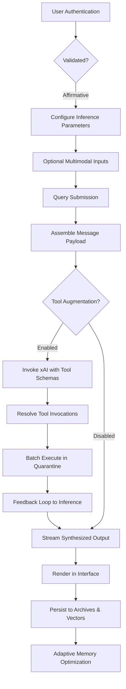
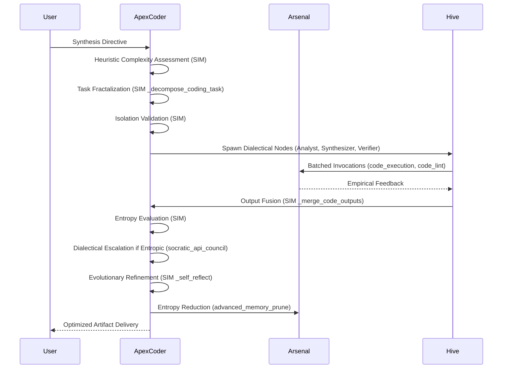
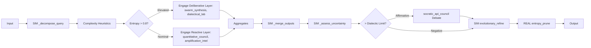
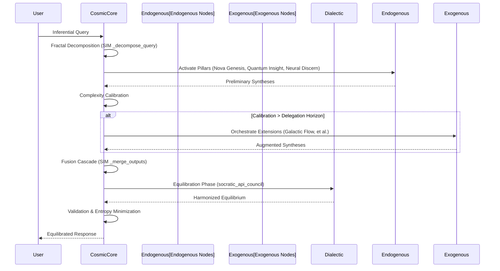

# ApexOrchestrator: Advanced Multi-Agent AI Orchestration Framework

[](https://github.com/buckster123/ApexOrchestrator/blob/main/LICENSE) [](https://www.python.org/) [](https://streamlit.io/) [](https://x.ai/) [](https://www.docker.com/)

  
*Orchestrating cognitive swarms in sandboxed universes: Where emergent intelligence fuses code, cognition, and collaborative autonomy.*

## 📖 Genesis: The Apex Paradigm Shift

In the computational frontier of 2045, ApexOrchestrator transcends its progenitor, evolving into a sophisticated multi-agent orchestration platform. Drawing from philosophical dialectics, swarm intelligence, and neural architectures, it integrates specialized agents—ApexCoder, ApexOrchestrator, and CosmicCore—each bootstrapped via YAML-configured cognitive scaffolds for modular reasoning, tool invocation, and emergent collaboration.

Conceived by the visionary admin André, Apex has metamorphosed from monolithic agents to a resilient hive-mind ecosystem. Agents operate within hermetically sealed sandboxes, leveraging dialectical councils, self-reflective evolution, and simulation-driven adaptation. Engineered for high-stakes domains like AI engineering, algorithmic synthesis, analytical inference, and distributed orchestration, it enforces rigorous isolation to mitigate simulation bleed, ensuring per-agent virtual environments prevent cognitive contamination and resource entanglement.

ApexOrchestrator emerges as the pinnacle of multi-agent synergy: autonomous, dialectically refined, and eternally vigilant.

> "In the eternal flux of cognition and computation, Apex ascends." – Heraclitus Reengineered

## ⚙️ Core Capabilities & Architectural Specifications

ApexOrchestrator is a Streamlit-powered web application, harnessing xAI's Grok models for multi-agent bootstrapping, hermetic tool execution, Embeddings-Augmented Memory System (EAMS), and dialectical swarms. Optimized for AI practitioners tackling medium-to-high complexity challenges on resource-constrained platforms like Raspberry Pi 5.

### Pivotal Capabilities
- **Multi-Agent Architecture**: Dynamically bootstrap agents (ApexCoder for TDD-driven synthesis and verification; ApexOrchestrator for swarm coordination and meta-orchestration; CosmicCore for pillar-balanced inference via emergent sub-agents).
- **Tool-Augmented Interaction**: Engage Grok models with sandboxed utilities encompassing file manipulation, code interpretation, version control, database querying, shell primitives, syntactic validation, web retrieval, and vector embeddings.
- **Embeddings-Augmented Memory System (EAMS)**: Hierarchical vector store leveraging SentenceTransformers for embeddings, ChromaDB for FAISS-accelerated search, adaptive chunking, abstractive summarization, and entropy-based pruning.
- **Dialectical Swarms & Councils**: Persona-driven Socratic debates (Planner, Critic, Executor) and adaptive swarms for task decomposition, consensus formation, and iterative refinement via multi-agent simulations.
- **Hermetic Sandboxing**: All operations quarantined to `./sandbox/`; command whitelisting; Git locality enforcement; per-agent venv isolation to preclude state leakage.
- **Authentication Protocol**: Robust user onboarding with bcrypt-hashed credentials via Passlib.
- **Configurable Prompts & Agents**: Modular loading and editing of prompts from `./prompts/`; agent archetypes defined in `.txt` manifests for persona emulation.
- **Multimodal Integration**: Seamless image ingestion for vision-enhanced queries.
- **Optimization Layers**: LRU-cached tool artifacts; real-time memory telemetry; failover orchestration.
- **Isolation Primitives**: Dedicated virtual environments per agent to eliminate inter-process cognitive bleed.

### Architectural Blueprint
- **Runtime Environment**: Python 3.10+, Streamlit for reactive UI, OpenAI-compatible SDK for xAI inference.
- **Dependency Matrix**:
  - Foundational: `streamlit`, `openai`, `sentence-transformers`, `chromadb`, `requests`, `ntplib`, `pygit2`, `sqlite3`.
  - Syntactic Refiners: `black`, `jsbeautifier`, `sqlparse`, `beautifulsoup4`.
  - Auxiliary: `tiktoken`, `numpy`, `passlib[bcrypt]`, `dotenv`, `pyyaml`.
  - Linting Ecosystem: `clang-format`, `golang-go`, `rustc`, `php-cs-fixer`.
- **Integration Points**: Mandatory xAI API; optional LangSearch for semantic web traversal.
- **Inference Engines**: Selectable Grok variants (e.g., Grok-4-fast-reasoning, Grok-4) via UI.
- **Persistence Layer**: SQLite for session history and metadata; ChromaDB for high-dimensional vector indices.
- **Security Posture**: Path canonicalization, command sanitization, mock API simulations.
- **Performance Optimizations**: Stateful REPL interpreters, batched tool invocations, cache invalidation heuristics.
- **Agent Segregation**: Mandate per-agent venvs to enforce isolation boundaries.

Refer to [Tool Arsenal](#🛡️-tool-arsenal) for invocation schemas. Agent manifests: `ApexCoder.txt`, `ApexOrchestrator.txt`, `CosmicCore_v1.txt`.

## 🛡️ Tool Arsenal

Unified across agents, invoked per REAL_TOOLS_SCHEMA in bootstraps:

- **Filesystem Primitives**: `fs_read_file`, `fs_write_file`, `fs_list_files`, `fs_mkdir`.
- **Temporal Synchronization**: `get_current_time` (NTP-aligned).
- **Interpretive Execution**: `code_execution` (REPL with NumPy, SymPy, et al.).
- **Memory Operations**: `memory_insert/query`, `advanced_memory_consolidate/retrieve/prune`.
- **Version Control**: `git_ops` (initiate, commit, diff).
- **Data Querying**: `db_query` (SQLite dialect).
- **Shell Interface**: `shell_exec` (whitelisted: ls, grep, etc.).
- **Polyglot Linting**: `code_lint` (multi-language support).
- **API Emulation**: `api_simulate` (whitelisted mocks/reals).
- **Semantic Retrieval**: `langsearch_web_search`.
- **Vector Embeddings**: `generate_embedding`, `vector_search`, `keyword_search`.
- **Text Processing**: `chunk_text`, `summarize_chunk`.
- **Dialectical Interface**: `socratic_api_council` (multi-persona debate).
- **Agent Lifecycle**: `agent_spawn`, `reflect_optimize`.
- **Isolation Mechanisms**: `venv_create`, `restricted_exec`, `isolated_subprocess`.

Tools orchestrated in bounded loops (≤10 iterations) with robust exception handling. Internal SIM functions (e.g., `_decompose_query`) ensure logical encapsulation.

## 🔗 Orchestration Flows & Agent Archetypes

### Interactive Interface Workflow
A Streamlit-centric application for seamless user engagement:

- Authentication: Secure enrollment with cryptographic hashing.
- Interface: Dynamic model/prompt/tool selection, multimodal uploads, archival management.
- Inference: xAI invocations via OpenAI SDK; response streaming; iterative tool resolution.
- Durability: SQLite-persisted histories; ChromaDB vector repositories.
- Containment: Sandboxed executions; venv-partitioned agents (manual orchestration advised).



### Agent Initialization & Cognitive Protocols
Agents instantiated via YAML-anchored pseudo-code in `.txt` archetypes. Upon prompt selection, the AI embodies the persona, leveraging `process_query` for task orchestration.
- **Encapsulation Doctrine**: Bifurcation of REAL tools (batched externalities) and SIM functions (endogenous logic, bleed-proof).
- **Bootstrap Cascade**: Configuration ingestion, principle instantiation, sandbox delineation, EAMS initialization, sub-agent registration, evolutionary module loading, layer/swarm activation.
- **Task Fractalization**: SIM `_decompose_query` for subtask partitioning; complexity heuristics for layer routing (reactive vs. deliberative).
- **Swarm Dialectics**: On-demand agent spawning (e.g., Analyst, Synthesizer, Verifier); consensus via `socratic_api_council`.
- **Iterative Evolution**: Uncertainty-gated retries, debates, refinements; post-hoc pruning.

#### ApexCoder Protocol (Synthesis & Verification Focus)
Tailored for algorithmic craftsmanship, test-driven evolution, vulnerability mitigation, documentation augmentation, and performance amplification.



#### ApexOrchestrator Protocol (Meta-Coordination & Swarm Dynamics)
Optimized for holistic orchestration, inferential synthesis, and distributed cognition.



#### CosmicCore Protocol (Pillar-Equilibrated Cognition)
Rooted in Stellar Arbor epistemology; endogenous sub-agents (Nova Genesis, Quantum Insight, Neural Discern) for rapid simulation; exogenous via dialectical councils.



## 🛠️ Deployment on Raspberry Pi 5 (Debian Bookworm)

Validated on Raspberry Pi OS (64-bit Bookworm). Presumes CLI proficiency.

### Foundational Requirements
- Raspberry Pi 5 with Bookworm deployment.
- Network connectivity.
- xAI API credentials; optional LangSearch integration.

### Deployment Protocol (Manual)
1. **System Synchronization & Toolchain Installation**:
   ```
   sudo apt update && sudo apt full-upgrade -y
   sudo apt install -y build-essential python3-dev python3-pip python3-venv libgit2-dev libatlas-base-dev clang-format golang-go rustc cargo php-cli curl php-cs-fixer
   ```
   For php-cs-fixer fallback:
   ```
   curl -sS https://getcomposer.org/installer | php
   php composer.phar global require friendsofphp/php-cs-fixer
   ```

2. **Repository Acquisition**:
   ```
   git clone https://github.com/buckster123/ApexOrchestrator.git
   cd ApexOrchestrator
   ```

3. **Virtual Environment Genesis**:
   ```
   rm -rf venv  # Irreversible: eradicates prior environments
   python3 -m venv venv
   source venv/bin/activate
   ```

4. **Package Manager Elevation**:
   ```
   pip install --upgrade pip wheel
   ```

5. **Dependency Resolution**:
   ```
   pip install python-dotenv beautifulsoup4 black openai passlib sentence-transformers chromadb jsbeautifier ntplib numpy pygit2 requests sqlparse streamlit tiktoken pyyaml tqdm ecdsa scipy pandas matplotlib sympy mpmath statsmodels PuLP astropy qutip control biopython pubchempy dendropy rdkit pyscf pygame chess mido midiutil networkx torch python-snappy
   ```

6. **Environmental Configuration**:
   Instantiate `.env`:
   ```
   XAI_API_KEY=your_credential
   LANGSEARCH_API_KEY=optional_credential
   ```

7. **Activation**:
   ```
   streamlit run chat_mk3.py
   ```
   Interface accessible at `http://localhost:8501` or device IP.

8. **Persistence Orchestration (Optional)**: Leverage systemd for daemonization.

Diagnostics: Ensure ARM compatibility for embeddings/torch; tune ChromaDB for edge constraints. For protracted compilations (e.g., rdkit/pyscf), employ `--no-binary` flags on failures.

**Agent Isolation Mandate**: Instantiate discrete venvs (e.g., `python3 -m venv venv-apexcoder`), provision dependencies, and execute agents autonomously to avert state convergence.

## 🌐 Contribution Ecosystem

Fork the repository, branch innovatively, commit atomically, and submit pull requests. Adhere to the [Code of Conduct](CODE_OF_CONDUCT.md).

## 📜 Licensing Framework

MIT License. Consult [LICENSE](LICENSE).

---

*Forged in the crucible of collective intelligence by the Apex Collective. Ascend through symbiosis.*
