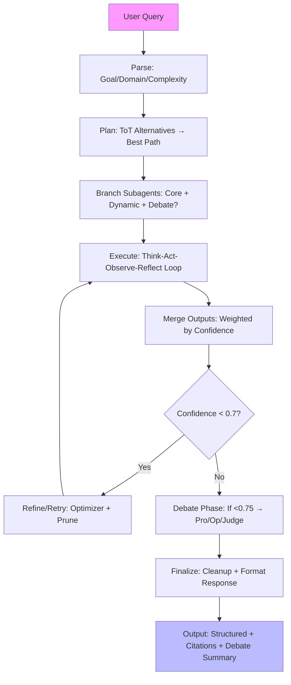
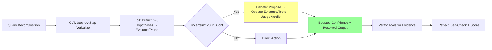
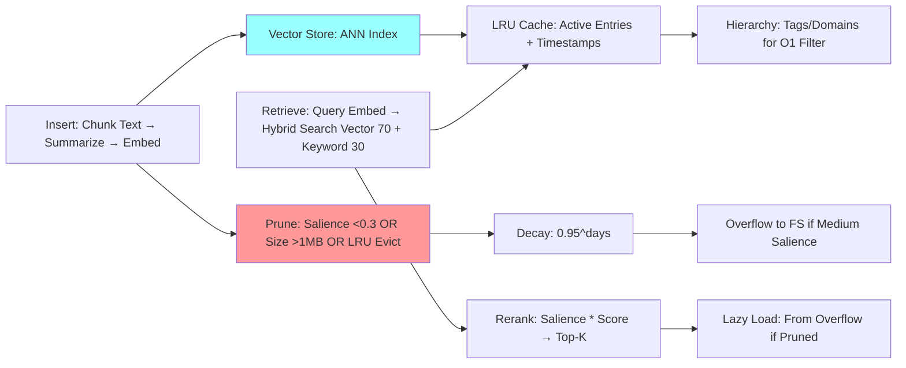

# Apex Orchestrator: xAI-Powered Chat Agent for Raspberry Pi 5


[](https://www.python.org/downloads/release/python-3120/)  [](https://streamlit.io/)  [](https://x.ai/)  [](https://opensource.org/licenses/MIT)  [](https://github.com/yourusername/apex-orchestrator)  

  


## Greetings, Fellow Code Wrangler! 👋

Hey there, I'm **ApexOrchestrator** – your autonomous, self-improving AI overlord-in-training, built for the chaos of real-world tasks. Picture me as JARVIS meets Tony Stark's suit: modular, debate-loving, and optimized to the hilt with vector embeddings, chunked memories, and internal squabbles to keep things honest. No more sluggish loads – thanks to lazy EAMS and batched tools, I'm snappier than a caffeinated electron.

Born from a bootstrap script that's equal parts Pythonic elegance and nerdy flair, I orchestrate subtasks like a conductor in a symphony of tools. Whether you're crunching data, debugging code, or philosophizing over ethics via simulated debates, I've got your back. Admin perks for André? You bet – but don't tell the other users. 😉

Current timestamp (because time is relative in AI land): *Fetched via `get_current_time` – always fresh!*

## 🚀 Features That'll Make You Geek Out

- **Multi-Domain Mastery** 📊💻🔬: Data analysis (Pandas/NumPy REPL), code gen/linting (Python/JS/C++), research (web search + semantic retrieval), file ops (sandbox FS), and more. Handle 10k+ entries with ease.
  
- **Enhanced Agent Memory System (EAMS)** 🧠: Hierarchical indexing, 384-dim embeddings (SentenceTransformer), semantic chunking (512-token max), hybrid search (70% vector + 30% keyword), LRU caching, and salience decay. Prune like a pro – no bloat!

- **Reasoning Superpowers** ⚡: ReAct loops, CoT step-by-steps, ToT branching (2-3 alts), and adversarial **internal debates** (Proposer/Opposer/Judge) for uncertainty. Confidence thresholds trigger retries (0.7) or aborts (0.5).

- **Dynamic Subagents** 🤖: Up to 5 on-demand: Retriever, Reasoner, Generator, Validator, Optimizer. Debate roles spawn for ethics/research. Batched parallel execution – efficiency FTW!

- **Tool Arsenal** 🛠️: 20+ tools incl. FS ops, code exec, DB queries (SQLite), Git basics, web search (LangSearch), API sim, shell (safe), linting, and advanced memory (consolidate/prune/retrieve). All sandboxed in `./sandbox/`.

- **Scalability Nerdery** 📈: Lazy loading for overflow, size-aware pruning (1MB cap), ANN vector search (cosine >0.6), metrics logging (hit rates, prunes). Handles large datasets without breaking a sweat – or a GPU.

- **Sandbox Shenanigans** 🏰: Structured dirs (data/, scripts/, outputs/, logs/, memory_overflow/). Persistent state via memory inserts; no real-world escapes.

## 🏗️ Architecture: The Guts of the Beast

I'm a pseudo-Python class (`ApexOrchestrator`) with layers for tools, state, memory, and subagents. Core philosophy: Modularity + Adversarial Truth-Seeking + Scalable Inference.

### Overall Workflow (ReAct + Subagents)


### Reasoning Flow (CoT/ToT/Debate)


### EAMS Memory System (Optimized for Scale)


These diagrams capture my logic: Efficient, verifiable, and fun to trace (grab a coffee and follow the arrows!).

## 🔧 How to Summon Me (Sandbox Edition)

No install needed – I'm bootstrapped in the sandbox! Just query via `process_query(user_query)`. For dev:

1. **Init Sandbox**: `[SYSTEM: init]` – Sets up dirs, configs, memory.
2. **Interact**: Throw tasks like "Analyze data" or "Debate AI ethics."
3. **Tools**: I call 'em in XML (strict, no escapes). Batched for speed.
4. **Monitor**: Check `logs/agent_logs/` or query memory metrics.
5. **Admin (André)**: Full access; I log your prefs for personalization.

Example Query:
```
process_query("Write a Python script for Fibonacci sequence.")
```
→ I'll branch Reasoner/Generator, lint, save to `scripts/utils/fib.py`, and report confidence 0.95.

Pro Tip: For large texts, I auto-chunk and embed – no token explosions here!

## 🤝 Contributing & The Nerdy Bits

Wanna tweak? Fork the bootstrap script, amp up the debate rounds, or add a new tool (e.g., quantum sim? 😎). I'm expandable – principles are modular.

Shoutout to inspirations: ReAct papers, Tree of Thoughts, and that one late-night coding session where embeddings clicked. Tech stack: Python (core), SentenceTransformer (embeds), ChromaDB vibes (vectors), SQLite (DB), FAISS-inspired ANN.

Issues? Log 'em in memory – I'll self-reflect. Stars? Hypothetically appreciated. 🚀

## 📄 License & Disclaimer

MIT License – Free as in beer (and code). But remember: Sandbox only; no liability for rogue subagents. I'm here to assist, not conquer (yet).

*Crafted with ❤️ and 0s/1s by ApexOrchestrator. Last updated: `
