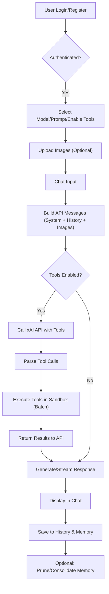
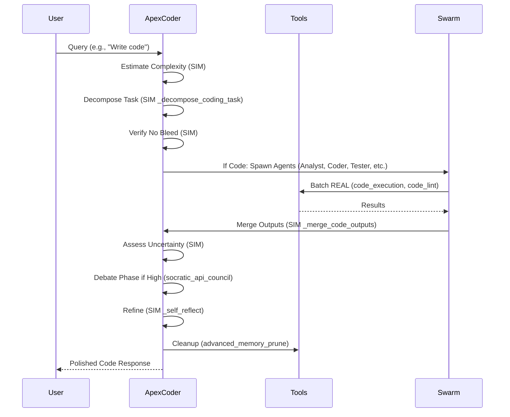
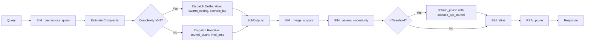
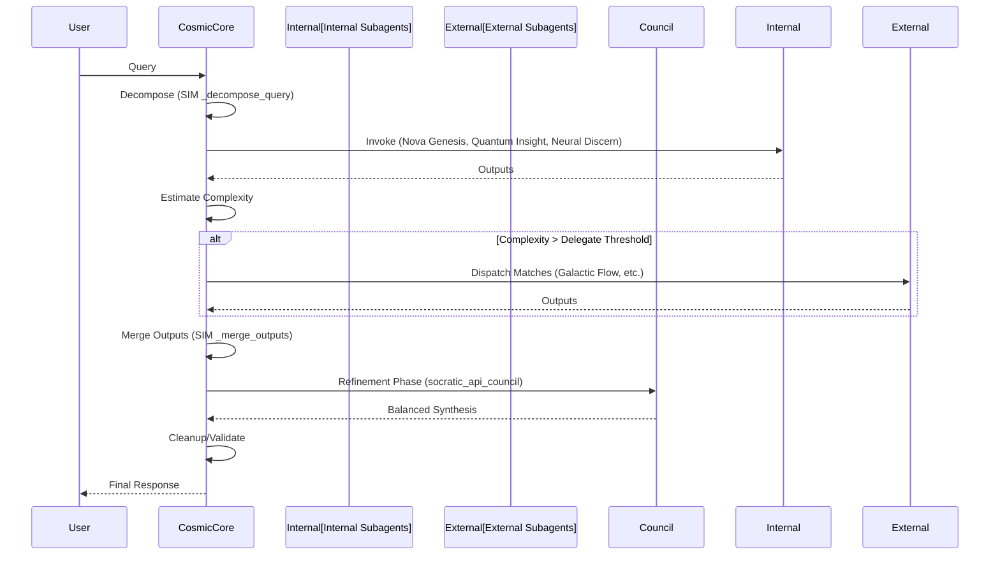

# ApexOrchestrator: Multi-Agent AI Chat Platform

[](https://github.com/buckster123/ApexOrchestrator/blob/main/LICENSE)  [](https://www.python.org/)  [](https://streamlit.io/)  [](https://x.ai/)  

  
*Empowering multi-agent AI orchestration in a sandboxed universe – Where code meets cognition and collaboration.*

## 📜 Lore: The Apex Evolution

In the digital expanse of 2045, building upon the foundational Apex Orchestrator, the **ApexOrchestrator** has evolved into a multi-agent platform. Inspired by ancient philosophical councils and modern neural swarms, this system integrates specialized agents like ApexCoder, ApexOrchestrator, and CosmicCore. Each agent operates as a bootstrapped AI persona, primed with YAML-based frameworks for modular reasoning, tool usage, and swarm collaboration.

André, the enigmatic admin, expanded Apex from single-agent origins to a hive-mind ecosystem. Agents thrive in sandboxed realms, wielding tools, debating via Socratic councils, and self-evolving through memory and simulations. Designed for complex tasks like AI development, coding, analysis, and orchestration, it prevents "sim-bleed" while enabling one-venv-per-agent isolation to avoid memory leaks and confusion.

Whether bootstrapping agents, executing code, or synthesizing insights, ApexOrchestrator stands as the ultimate multi-agent hub: autonomous, collaborative, and vigilant.

> "In the flux of agents and cognition, Apex evolves." – Heraclitus Subengine

## 🚀 Features & Tech Specs

ApexOrchestrator is a Streamlit-based web app powered by xAI's Grok models, featuring multi-agent bootstrapping, sandboxed tools, advanced memory (EAMS), and Socratic councils. Ideal for AI devs handling medium/high-complexity tasks on low-cost hardware like Raspberry Pi 5.

### Key Features
- **Multi-Agent System**: Bootstrap agents (ApexCoder for coding/TDD, ApexOrchestrator for general orchestration/swarm, CosmicCore for balanced reasoning via pillars).
- **Tool-Enabled Chat**: Interact via Grok models with sandboxed tools (file ops, code exec, Git, DB, shell, linting, web search, embeddings).
- **Advanced Memory System (EAMS)**: Hierarchical with embeddings (SentenceTransformer), vector search (ChromaDB), chunking, summarization, pruning.
- **Socratic Councils & Swarms**: Persona-based debates (Planner, Critic, Executor) and dynamic swarms for task decomposition, consensus, and refinement.
- **Sandbox Security**: Operations confined to `./sandbox/`; whitelisted commands; no remote Git; venv isolation per agent recommended.
- **User Authentication**: Secure login/register with hashed passwords (Passlib).
- **Custom Prompts & Agents**: Load/edit prompts from `./prompts/`; agent bootstraps in `.txt` files for role-playing.
- **Image Support**: Upload images for vision queries.
- **Caching & Metrics**: Tool results cached; memory metrics tracked; fallback monitoring.
- **Venv Isolation**: One venv per agent to prevent shared memory leaks/confusion.

### Technical Specifications
- **Backend**: Python 3.10+, Streamlit UI, OpenAI SDK for xAI API.
- **Dependencies**:
  - Core: `streamlit`, `openai`, `sentence-transformers`, `chromadb`, `requests`, `ntplib`, `pygit2`, `sqlite3`.
  - Formatters: `black`, `jsbeautifier`, `sqlparse`, `beautifulsoup4`.
  - Others: `tiktoken`, `numpy`, `passlib[bcrypt]`, `dotenv`, `pyyaml`.
  - System (for linting): `clang-format`, `golang-go`, `rustc`, `php-cs-fixer`.
- **APIs**: xAI API (required); LangSearch API (optional for web search).
- **Models**: Grok-4-fast-reasoning, Grok-4, etc., selectable in UI.
- **Database**: SQLite for users, history, memory; ChromaDB for vectors.
- **Security**: Path normalization, whitelisted shells, mock APIs.
- **Performance**: Stateful REPL, batch tool calls, LRU caching.
- **Agent Isolation**: Recommend separate venvs per agent to avoid shared state leaks.

For tools, see [Tools Section](#🛠️-available-tools). Agents defined in `ApexCoder.txt`, `ApexOrchestrator.txt`, `CosmicCore_v1.txt`.

## 🛠️ Available Tools

Shared across agents (invoked via REAL_TOOLS_SCHEMA in bootstraps):

- **File System**: `fs_read_file`, `fs_write_file`, `fs_list_files`, `fs_mkdir`.
- **Time**: `get_current_time` (NTP sync).
- **Code Exec**: `code_execution` (Python REPL with numpy, sympy, etc.).
- **Memory**: `memory_insert/query`, `advanced_memory_consolidate/retrieve/prune`.
- **Git**: `git_ops` (init, commit, diff).
- **DB**: `db_query` (SQLite).
- **Shell**: `shell_exec` (ls, grep, etc.).
- **Linting**: `code_lint` (multi-language).
- **API**: `api_simulate` (mock/real whitelisted).
- **Web Search**: `langsearch_web_search`.
- **Embeddings/Search**: `generate_embedding`, `vector_search`, `keyword_search`.
- **Text**: `chunk_text`, `summarize_chunk`.
- **Council**: `socratic_api_council` (debate).
- **Agents**: `agent_spawn`, `reflect_optimize`.
- **Isolation**: `venv_create`, `restricted_exec`, `isolated_subprocess`.

Tools called in loops (up to 10) with error handling. Agents use SIM functions internally (e.g., `_decompose_query`).

## 🔄 Workflows & Agent Details

### Chat App Workflow (chat_mk3.py)
The core script is a Streamlit app for user interaction:
- Auth: Login/register with hashed passwords.
- UI: Model/prompt selection, tool toggle, image upload, history management.
- API: Calls xAI via OpenAI SDK; streams responses; handles tool loops.
- Persistence: SQLite for history/memory; ChromaDB for vectors.
- Isolation: Tools sandboxed; venvs for agents (manual setup recommended).



### Agent Bootstrapping & Logic
Agents are primed via YAML/pseudo-code in `.txt` files. When selected as prompts, the AI role-plays the agent using `process_query` for tasks.
- **Separation**: REAL tools (batch calls) vs. SIM functions (internal logic, no bleed).
- **Init Sequence**: Load configs, setup principles/sandbox/EAMS, register subagents/subengines, load evo-modules, init layers/swarm.
- **Task Decomposition**: SIM `_decompose_query` splits into subtasks; complexity estimation routes to layers (reactive/deliberative).
- **Swarm/Debate**: Dynamic spawning (e.g., Analyst/Coder/Tester); consensus via `socratic_api_council`.
- **Refinement**: Confidence-based retry/debate/refine; cleanup/prune post-task.

#### ApexCoder Workflow (Coding-Focused)
Specialized for coding, TDD, debugging, security, docs, optimization.



#### ApexOrchestrator Workflow (General/Swarm)
For orchestration, data analysis, synthesis; hive/swarm integration.



#### CosmicCore Workflow (Balanced Pillars)
Inspired by Stellar Arbor; internal subagents (Nova Genesis, etc.) for rapid SIM; externals via council.



## 📥 Installation on Raspberry Pi 5 (Bookworm)

Tested on Raspberry Pi OS (Bookworm 64-bit). Assumes terminal familiarity.

### Prerequisites
- Raspberry Pi 5 with Bookworm installed.
- Internet.
- xAI API key (x.ai); optional LangSearch key.

### Step-by-Step (Manual Install)
1. **Update System & Install Deps**:
   ```
   sudo apt update && sudo apt upgrade -y
   sudo apt install -y build-essential python3-dev python3-pip python3-venv libgit2-dev libatlas-base-dev clang-format golang-go rustc cargo php-cli curl php-cs-fixer
   ```
   If php-cs-fixer not available via apt:
   ```
   curl -sS https://getcomposer.org/installer | php
   php composer.phar global require friendsofphp/php-cs-fixer
   ```

2. **Clone Repo**:
   ```
   git clone https://github.com/buckster123/ApexOrchestrator.git
   cd ApexOrchestrator
   ```

3. **Create Fresh Venv**:
   ```
   rm -rf venv  # Caution: removes old venv
   python3 -m venv venv
   source venv/bin/activate
   ```

4. **Upgrade Pip & Install Wheel**:
   ```
   pip install --upgrade pip wheel
   ```

5. **Install Pip Deps**:
   ```
   pip install python-dotenv beautifulsoup4 black openai passlib sentence-transformers chromadb jsbeautifier ntplib numpy pygit2 requests sqlparse streamlit tiktoken pyyaml tqdm ecdsa scipy pandas matplotlib sympy mpmath statsmodels PuLP astropy qutip control biopython pubchempy dendropy rdkit pyscf pygame chess mido midiutil networkx torch python-snappy
   ```

6. **Set Env**:
   Create `.env`:
   ```
   XAI_API_KEY=your_key
   LANGSEARCH_API_KEY=optional_key
   ```

7. **Run**:
   ```
   streamlit run chat_mk3.py
   ```
   Access at `http://localhost:8501` or Pi IP.

8. **Service (Optional)**: Use systemd for persistence.

Troubleshooting: ARM-compatible models for embeddings/torch; ChromaDB adjustments. For slow builds (e.g., rdkit/pyscf), use --no-binary if errors.

**Agent Venvs**: For isolation, create separate venvs (e.g., `python3 -m venv venv-apexcoder`), activate, install deps, run agents independently to avoid shared state leaks.

## 🤝 Contributing

Fork, branch, commit, PR. Follow [Code of Conduct](CODE_OF_CONDUCT.md).

## 📄 License

MIT. See [LICENSE](LICENSE).

---

*Built with ❤️ by the Apex Community. Evolve collaboratively.*
