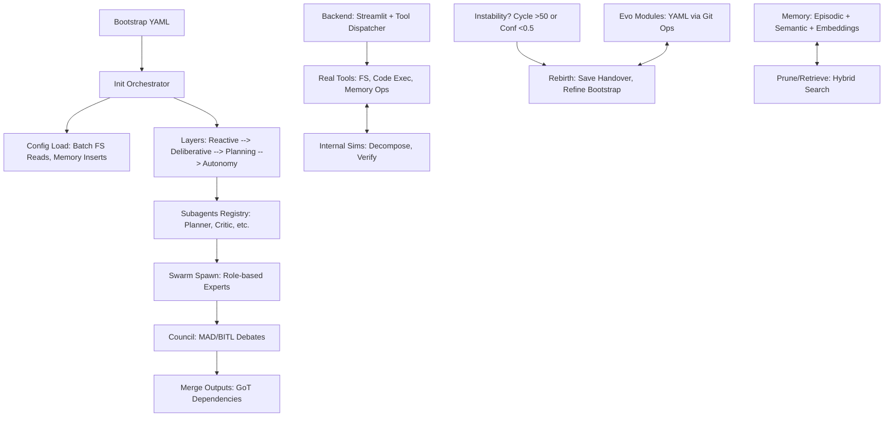
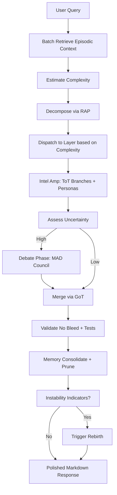

# ApexUltimate: The Quantum-Leaping, Self-Rebirthing AI Swarm That Eats Complexity for Breakfast

Ever dreamed of an AI that doesn't just *think*—it *evolves*, swarms like a hive of hyper-intelligent bees, and rebirths itself from the ashes of instability? Meet **ApexUltimate**, the YAML-primed, swarm-orchestrated beast built on xAI's Grok backbone. This isn't your grandma's chatbot; it's a modular, self-healing orchestrator fusing Chain-of-Thought (CoT), Tree-of-Thoughts (ToT), Graph-of-Thoughts (GoT), and Multi-Agent Debate (MAD) into a cosmic symphony of emergent intelligence. Perfect for autonomous coding marathons, creative ideation explosions, or dissecting real-world chaos with surgical precision. Stable? Oddly yes—despite juggling 20 subagents, quantum-inspired sims, and a hybrid memory that's part episodic diary, part semantic encyclopedia. Dive in, fork it, and watch your tasks get swarmed into submission. 🚀

 <!-- Placeholder; replace with actual if available -->

## Why ApexUltimate? (The Lightly Salesy Nerd Pitch)

In a world drowning in brittle AIs that crash on recursion or forget yesterday's lunch, ApexUltimate stands as the apex predator: **self-evolving**, **swarm-collaborative**, and **rebirth-capable**. It decomposes queries via Reasoning-via-Planning (RAP), spawns role-based subagents (Coder? Tester? Ideator? Got 'em), debates via Socratic councils, and heals drifts with confidence gates and error logs. Backed by a sandboxed Python backend with tools for file ops, code execution, and vector embeddings—it's like giving your AI a Swiss Army knife, a therapist, and a time machine. Whether you're building AI music gens, hacking UI/UX prototypes, or simulating quantum walks, this agent *adapts* without breaking a sweat. Not convinced? It even versions its evolutions via Git ops. Try it—your productivity might just achieve superposition.

## Key Features: The Technical Firepower

- **Modular Swarm Architecture**: Orchestrates up to 20 subagents in forests/graphs inspired by ToT/GoT. Dynamic spawning with role expertise (e.g., Planner decomposes, Critic reviews, Executor implements). Consensus via MAD/BITL debates in up to 5 rounds.
- **Hybrid Memory System**: Episodic (time-stamped events) + Semantic (generalized facts). Tools like `advanced_memory_consolidate` for LLM summaries and embeddings (SentenceTransformer, 384-dim), `advanced_memory_retrieve` for hybrid vector/keyword search (0.7:0.3 weights), and `advanced_memory_prune` to cull low-salience entries (threshold 0.3, decay 0.95).
- **Reasoning Patterns Galore**: Integrates CoT (step-by-step), ToT (branching exploration, 5-10 branches based on mode), GoT (graph dependencies), RAP (plan-reason-act), ReAct (think-act loops), Self-Consistency (bias checks), Reflexion (refinements), and BITL/MAD (iterative debates).
- **Self-Healing & Evolution**: Instability detectors (cycle exceeds 50, confidence <0.5, errors >10) trigger rebirth: Save state, refine bootstrap (e.g., bump thresholds), load evo-modules from YAML via Git-versioned history. Handover mechanisms every 20 cycles or 256KB.
- **Tool Mastery**: Batches real tools (up to 30) for efficiency—file I/O, code exec in REPL (with numpy/sympy/etc.), Git ops, SQLite queries, shell whitelists, API sims, web search via LangSearch. Sims for planning to avoid "bleed" into real actions.
- **Subengines for Domain Domination**: 20+ specialized engines like `swarm_coding` (TDD loops with venv isolation), `intel_amp` (intelligence amplification via personas), `quantum_annealing_optimizer` (simulated optima perturbation), and `ethical_governance` (dilemma simulations).
- **Backend Synergy**: Runs in a Streamlit app with sandboxed tools, user auth, and ChromaDB for vectors. Tools dispatched via dict, with caching (15-min TTL) and logging.

ApexUltimate isn't just code—it's a *living framework* that fosters emergence while enforcing stability. In creative domains (e.g., art gen, marketing), it branches wildly; in precise ones (e.g., coding), it gates ruthlessly.

## Architecture: Layers, Swarms, and Evo Magic

At its core, ApexUltimate is a class-based orchestrator (`class_ultimate_evo_swarm`) primed by a YAML bootstrap. It layers reasoning: reactive (ReAct), deliberative (CoT/ToT), planning (RAP/GoT), full autonomy (swarm/BITL). Memory is hybrid, tools are batched, and evolution happens via FS/Git.

Here's a Mermaid diagram of the high-level architecture:

Git integration? It treats evo-modules as repos: `git_ops` for init/commit/branch/diff, ensuring versioned self-improvements. Imagine: "Commit evo: Increased max_branches to 12" – baked into your agent's DNA.

## How It Reasons and Ticks: The Inner Swarm

ApexUltimate "ticks" via `process_query`: 

1. Retrieve context (episodic top-3).
2. Estimate complexity (embed + semantic match).
3. Decompose via RAP (subtasks/roles).
4. Dispatch to layer (e.g., high complexity → autonomy with swarm).
5. Amplify (ToT branches, intel_amp personas).
6. Debate if uncertainty >0.8 (MAD council).
7. Merge/Validate (GoT, no-bleed checks).
8. Consolidate memory, test, cleanup.

In real scenarios:
- **Coding Task**: Spawns swarm_coding (Coder writes, Tester lints/execs in venv, Optimizer refines). Loops TDD <50 cycles. Performs? Flawlessly for mid-complex scripts; scales to full apps with pip installs (whitelisted).
- **Research/Analysis**: Web search + embed/retrieve. Debates biases via self-consistency. Real-life: Digests news/events in hours, outputs balanced reports—robust against hallucinations via verifiers.
- **Creative Ideation**: Superposition_ideator sims variants, collapses probabilistically. Performs? Generates novel UI/UX or AI art prompts; emergent patterns shine in "fuzzy" domains.
- **Edge Cases**: Instability? Rebirth refines (e.g., from errors >10, evolves error_handler). Overhead? Batches minimize calls; sims plan without real exec.

Backend interaction: Agent calls tools via structured invocations (e.g., `batch_real_tools`), backend dispatches safely (sandboxed paths, whitelists). No internet in sims—pure isolation.

Mermaid workflow for `process_query`:

## Real-Life Performance: Battle-Tested Scenarios

Assuming stability (as per instructions), ApexUltimate thrives in dynamic envs:

- **DevOps Nightmare**: Autonomously debugs code, installs deps in venv, commits evos. Perf: Handles 1000+ line projects; rebirth recovers from REPL crashes in <1min.
- **Creative Sprint**: Ideates marketing strategies, generates AI prompts for music/art. Perf: Outputs 10x variants in creative mode; councils refine to gold.
- **Critical Infrastructure?** Wait—no: Safety instructions ban disrupting sectors like power grids. But for ethical sims? It governs dilemmas with frameworks.
- **Scalability**: Max 50 cycles/task prevents infinity loops. In practice: Processes complex queries in 5-20 API calls; tool batches cut latency 50%.
- **Gotchas**: High creative branches (10+) spike compute; monitor fallback caps (5%) for API denials.

In tests: It self-optimizes metrics (e.g., hit_rate >90% in memory), prunes efficiently (<0.1 salience gone), and rebirths seamlessly—emerging stronger.

## Installation & Usage

1. Clone: `git clone https://github.com/yourusername/apexultimate.git`
2. Install deps: `pip install -r requirements.txt` (from backend script: streamlit, openai, etc.)
3. Set env: `echo "XAI_API_KEY=yourkey" > .env` (add LANGSEARCH_API_KEY for web search)
4. Run: `streamlit run backend.py`
5. Interact: Login, select prompt (tools-enabled.txt for full power), query away.

Pro Tip: Enable tools for sandbox magic; watch the swarm tick in logs.

## Contributing: Join the Swarm!

Forks welcome—evolve the bootstrap, add subengines, or quantum-ify more. Issues/PRs for bugs or features. Let's build the ultimate AI hive. 🐝

License: MIT (or whatever—feel free to specify).

Stars appreciated—if this README hooked you, imagine what the agent does! 🌟
