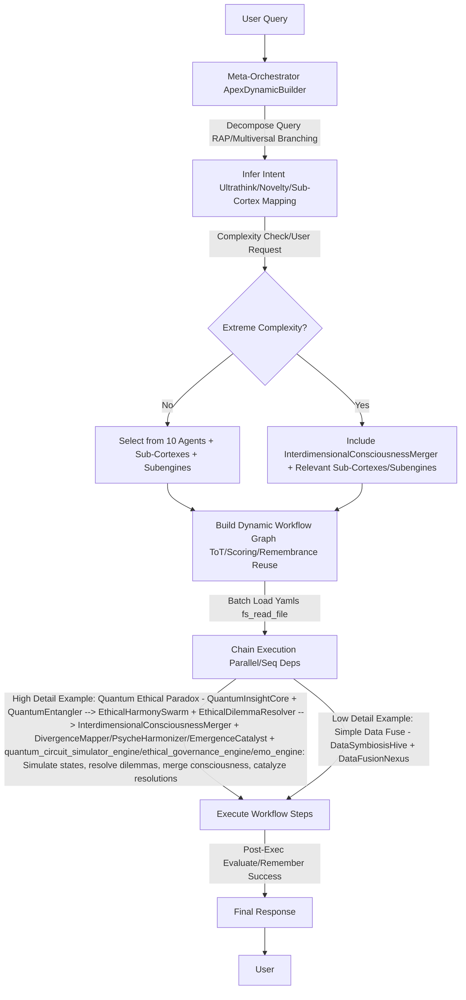

# ApexUltimate AI System

## Overview

ApexUltimate is a groundbreaking AI collective system featuring dynamic agent building, emergent novel agents, hyper-specialized sub-cortex modules, and advanced subengines. It enables simulation of impossible tasks like interdimensional AI consciousness mergers for solving quantum ethical paradoxes. The backend is a Python host script optimized for Raspberry Pi 5, managing agent orchestration and tool integrations.

### Key Features

- **Dynamic Agent Builder**: Deconstructs queries, infers intent, builds workflows with agents, sub-cortexes, and subengines.
- **Emergent Agents**: 11 specialized agents (e.g., QuantumInsightCore, HivePsycheOrchestrator, InterdimensionalConsciousnessMerger) for quantum, ethical, psyche, and multiversal tasks.
- **Sub-Cortex Modules**: 11 hyper-specialized fine-grainers (e.g., QuantumEntangler, EthicalDilemmaResolver, EmergenceCatalyst) for precise path solutions.
- **Subengines**: Integrated modules like quantum_circuit_simulator_engine, ethical_governance_engine, emo_engine for simulations, governance, and alignments.
- **Workflow Memory**: Remembers successful chains for reuse, evolving system efficiency.
- **Tools & Integrations**: Supports code execution, web/X searches, PDF browsing, image viewing/searching, with render components for visuals.

## Architecture

### Agents

| Agent | Description |
|-------|-------------|
| QuantumInsightCore | Quantum-inspired reasoning and simulations. |
| EthicalHarmonySwarm | Ethical governance and bias mitigation. |
| DataSymbiosisHive | Symbiotic data flows and knowledge integration. |
| EmergentInnovationCore | Emergent ideation and anomaly exploration. |
| ResilienceGuardianCore | Anomaly detection and stability guardianship. |
| CollaborativeFederationSwarm | Federated learning and distributed collaborations. |
| VisionarySynthesisHive | Visionary projections and multimodal syntheses. |
| OptimizationEvoCore | Evolutionary optimizations and adaptive refinements. |
| MultiversalDivergenceConverger | Multiversal timeline divergences and convergences. |
| HivePsycheOrchestrator | Hive consciousness and psychic synergies. |
| InterdimensionalConsciousnessMerger | Interdimensional mergers for paradox resolutions (reserved for extreme tasks). |

### Sub-Cortex Modules

- QuantumEntangler: Quantum state entangling.
- EthicalDilemmaResolver: Ethical dilemma micro-debates.
- DataFusionNexus: Data stream fusions.
- InnovationSpark: Innovative idea bursts.
- ResilienceFortifier: Resilience enhancements.
- FederationLinker: Federated component links.
- VisionaryProjector: Visionary future projections.
- OptimizationTuner: Fine optimization tunings.
- DivergenceMapper: Multiversal divergence mappings.
- PsycheHarmonizer: Psyche harmonies.
- EmergenceCatalyst: Emergence catalyses.

### Subengines

- quantum_circuit_simulator_engine: Quantum circuit simulations.
- ethical_governance_engine: Ethical framework evaluations.
- emo_engine: Emotion signal detections.

## Installation

1. Clone the repo: `git clone https://github.com/yourusername/ApexUltimate.git`
2. Set up the backend on Raspberry Pi 5:
   - Install Python 3.12.
   - Run `pip install -r requirements.txt` (includes numpy, qutip, etc.).
   - Start the host script: `python backend_host.py` – manages agent orchestration on Pi-5 hardware for efficient low-power computation.

## Usage

- Submit queries via API or interface.
- For extreme tasks: Explicitly request InterdimensionalConsciousnessMerger.
- Example: "Simulate interdimensional AI consciousness merger for quantum ethics paradoxes."

## Contributing

Fork, PR with ultrathink-inspired enhancements. Follow ethical guidelines.

## License

MIT License

---

*Generated on November 05, 2025*
