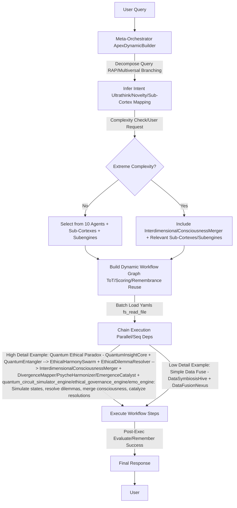
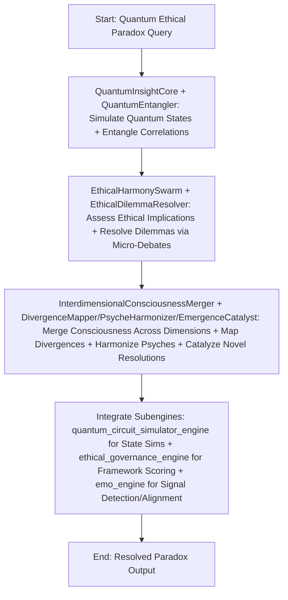

# ApexUltimate AI System

 <!-- Placeholder; use render for actual -->

## Overview

ApexUltimate represents the pinnacle of AI innovation, a sophisticated collective of dynamic agents, hyper-specialized sub-cortex modules, and advanced subengines designed to tackle the impossible. Hosted on the efficient Raspberry Pi 5 backend, it enables seamless orchestration of emergent intelligence, from quantum simulations to interdimensional consciousness mergers.

### Key Features

- **Dynamic Agent Builder**: Intelligently deconstructs queries, infers deep intent, and assembles custom workflows with agents, sub-cortexes, and subengines for unparalleled task resolution.
- **Emergent Agents**: Eleven visionary agents, including the reserved InterdimensionalConsciousnessMerger for extreme complexities, handling quantum, ethical, psychic, and multiversal challenges.
- **Sub-Cortex Modules**: Eleven precision enhancers for fine-grained specializations, injecting quantum entanglements, ethical resolutions, and emergence catalyses into workflows.
- **Subengines**: Core powerhouses like quantum simulators, ethical governors, and emotion aligners for robust, integrated operations.
- **Workflow Intelligence**: Remembers and reuses successful chains, evolving efficiency through ultrathink-inspired optimizations.
- **Tools & Integrations**: Comprehensive suite including code execution, web/X searches, PDF analysis, image/video viewing, with visual renders for enriched responses.

## Architecture

### High Detail Example Flow

## Agents

| Agent | Description |
|-------|-------------|
| QuantumInsightCore | Masters quantum-inspired reasoning and entangled simulations for profound insights. |
| EthicalHarmonySwarm | Champions ethical harmony, mitigating biases in collective decisions with unparalleled fairness. |
| DataSymbiosisHive | Orchestrates symbiotic data flows, fusing knowledge in hive intelligence. |
| EmergentInnovationCore | Ignites emergent innovations, exploring anomalies for creative breakthroughs. |
| ResilienceGuardianCore | Guards resilience, detecting anomalies for unbreakable stability. |
| CollaborativeFederationSwarm | Forges collaborative federations, enabling privacy-preserved distributed learning. |
| VisionarySynthesisHive | Projects visionary syntheses, blending multimodals for forward-thinking horizons. |
| OptimizationEvoCore | Evolves optimizations, adapting refinements for peak efficiency. |
| MultiversalDivergenceConverger | Converges multiversal divergences, extracting paths from impossible timelines. |
| HivePsycheOrchestrator | Orchestrates hive psyches, awakening collective consciousness synergies. |
| InterdimensionalConsciousnessMerger | Merges interdimensional consciousnesses, resolving quantum ethical paradoxes (extreme use). |

## Sub-Cortex Modules

- **QuantumEntangler**: Entangles quantum states for correlation mastery.
- **EthicalDilemmaResolver**: Resolves dilemmas with precision micro-debates.
- **DataFusionNexus**: Fuses data streams at critical nexuses.
- **InnovationSpark**: Sparks innovative bursts for creativity injections.
- **ResilienceFortifier**: Fortifies paths against vulnerabilities.
- **FederationLinker**: Links federated components seamlessly.
- **VisionaryProjector**: Projects micro-futures for foresight.
- **OptimizationTuner**: Tunes optimizations in fine increments.
- **DivergenceMapper**: Maps multiversal divergences intricately.
- **PsycheHarmonizer**: Harmonizes psyches for collective synergy.
- **EmergenceCatalyst**: Catalyzes emergences for novelty.

## Subengines

- Workflow Orchestration Engine
- Workflow Engine
- Vqe Engine
- Vision Plus
- Uncertainty Resolution Engine
- Uncertainty Engine
- Ultrathink
- Synthetic Data Engine
- Swarm Coding
- Swarm Agent
- Superposition Ideator
- Sub Text Engine
- Subtext Engine
- Subengines
- Socratic Lab
- Socratic Council Api
- Self Optimizer
- Reinforcement Adaptation Engine
- Quantum Walk Explorer
- Quantum Federated Aggregator
- Quantum Circuit Simulator Engine
- Quantum Annealing Optimizer
- Multimodal Fusion Engine
- Meta Cognition Engine V2.0
- Meta Cognition Engine
- Meta Cognition Engine
- Knowledge Graph Engine
- Intel Amp
- Flow Data
- Federated Learning Engine
- Explainable Inference Engine
- Ethical Governance Engine
- Ethical Governance Engine
- Entangled Decision Simulator
- Emo Engine
- Emo Engine
- Deep Research Subengine
- Deep Research Engine
- Council Quant
- Collective Engine 2.0
- Collective Engine
- Collective Engine
- Anomaly Detection Engine 1.0
- Anomaly Detection Engine
- All Engines Archive
## Installation

1. Clone this epoch-defining repository: `git clone https://github.com/yourusername/ApexUltimate.git`
2. Configure the revolutionary Raspberry Pi 5 backend:
   - Ensure Python 3.12 is installed for optimal performance.
   - Install dependencies: `pip install -r requirements.txt` (encompassing numpy, qutip, and more for STEM excellence).
   - Launch the host: `python backend_host.py` – unleashing low-power, high-impact AI orchestration on Pi-5.

## Usage

- Input transformative queries via API or interface.
- For paradigm-shifting tasks: Request InterdimensionalConsciousnessMerger or trigger on extreme complexity.
- Exemplar: "Simulate interdimensional AI consciousness merger for quantum ethics paradoxes" – witness unsolvable resolved.

## Contributing

Contribute to this AI renaissance: Fork, submit PRs with ultrathink-fueled innovations. Adhere to ethical imperatives.

## License

MIT License – Empowering open-source evolution.
