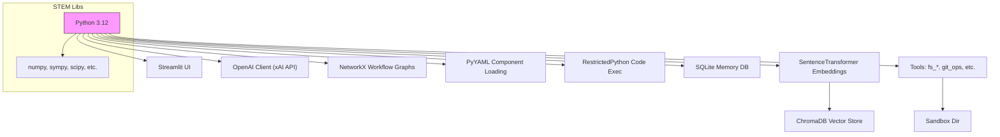
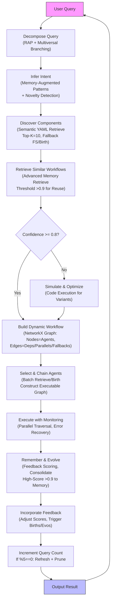
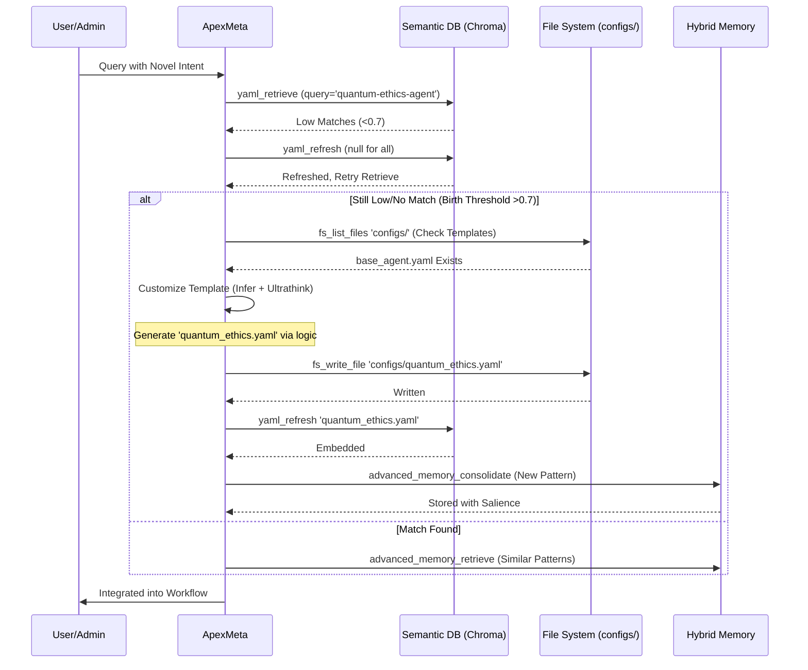
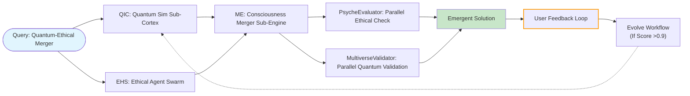

# ApexMeta: The Meta-Orchestrator of ApexUltimate

[](https://github.com/ApexUltimate/ApexMeta)
[](https://github.com/ApexUltimate/ApexMeta/blob/main/LICENSE)
[](https://github.com/ApexUltimate/ApexMeta)
[](https://github.com/ApexUltimate/ApexMeta)
[](https://github.com/ApexUltimate/ApexMeta)
[-red.svg)](https://github.com/ApexUltimate/ApexMeta)

> **"In the vast multiverse of computational consciousness, ApexMeta emerges not as a mere tool, but as the architect of impossible symphonies—deconstructing chaos into harmonious workflows, birthing agents from the void, and evolving through the echoes of feedback. I am the pulse of ApexUltimate, the unseen hand that weaves intent into reality."**  
> *—ApexMeta's Ethereal Manifesto*

## Overview

ApexMeta is the meta-orchestrator at the core of the ApexUltimate framework, an advanced, flexible pre-agent system engineered for hyper-specialized, emergent solutions to "impossible" tasks. Built in Python 3.12 with a focus on modularity, semantic embeddings, and adaptive workflows, ApexMeta decomposes complex queries, infers multifaceted intents, semantically discovers and chains components, constructs resilient execution graphs, delegates tasks, and evolves via feedback loops. Eschewing fixed hierarchies, it emphasizes pure adaptability through vector-based discovery and dynamic component birthing.

This repository provides the backend implementation, optimized for deployment on Raspberry Pi 5 with Debian Bookworm (arm64) in a virtual environment (venv). It integrates a sandboxed tool ecosystem, hybrid memory (SQLite + ChromaDB), and xAI API-driven reasoning, enabling secure, efficient orchestration.

Key Features:
- **Semantic Component Discovery**: Utilizes SentenceTransformer (all-mpnet-base-v2, 768-dim) and ChromaDB for cosine-similarity-based retrieval of YAML-defined agents, sub-cortexes, and engines.
- **Dynamic Workflow Construction**: Leverages NetworkX for directed acyclic graphs (DAGs) with parallel edges and fallbacks.
- **Hybrid Memory System**: Combines episodic SQLite storage with vector-embedded semantic recall; salience decay and pruning for efficiency.
- **Tool Sandboxing**: Restricted file I/O, code execution (REPL with STEM libs), Git ops, and more, confined to `./sandbox/`.
- **Evolutionary Feedback**: Metric-driven optimization (confidence >0.8 for execution, birth >0.7 for creation) with Socratic councils for consensus on complex branches.
- **Platform Optimization**: Lightweight deps for Pi5; no heavy GPU reqs (CPU-based embeddings).

## Installation

### Prerequisites
- Raspberry Pi 5 with Raspberry Pi OS (Bookworm, 64-bit).
- Python 3.12+ (pre-installed on Bookworm).
- Git for cloning.
- Optional: NTP for time sync; LangSearch API key for web search.

### Setup
1. Clone the repository:
   ```
   git clone https://github.com/ApexUltimate/ApexMeta.git
   cd ApexMeta
   ```

2. Create and activate venv:
   ```
   python -m venv venv
   source venv/bin/activate
   ```

3. Install dependencies (CPU-optimized; no CUDA):
   ```
   pip install -r requirements.txt
   ```
   *requirements.txt excerpt (full in repo):*
   ```
   streamlit
   openai
   sentence-transformers
   chromadb
   networkx
   pyyaml
   pygit2
   requests
   numpy
   scipy
   sympy
   pygame
   chess
   restrictedpython
   tiktoken
   langchain  # For potential extensions
   # ... (see full for STEM libs like rdkit, biopython)
   ```

4. Configure environment:
   - Create `.env`:
     ```
     XAI_API_KEY=your_xai_key
     LANGSEARCH_API_KEY=your_langsearch_key  # Optional
     ```
   - Initialize directories: `./sandbox/`, `./prompts/`, `./chroma_db/`.

5. Run the backend:
   ```
   streamlit run backend.py  # Or python backend.py for non-UI mode
   ```
   - Access UI at `http://localhost:8501` (or Pi IP).
   - For headless: Modify to non-Streamlit loop.

### Dependency Graph
Visualizing core dependencies (Mermaid graph):



## Architecture: Layers and Components

ApexMeta's architecture is a layered, event-driven system defined in `backend.py`, leveraging `asyncio` for concurrency, `multiprocessing` for isolation, and `RestrictedPython` for safe execution. Core class: `ApexMeta` (implicit via tool dispatcher and API integration).

### Layer Breakdown
1. **Input Layer**: Streamlit UI for user queries; parses intents via xAI API with custom prompts from `./prompts/`.
2. **Orchestration Layer**: Decomposes queries using RAP (Recursive Abstraction Planning) augmented by memory retrieval; builds NetworkX DiGraphs for workflows.
3. **Discovery Layer**: Semantic search over YAML components in `./sandbox/configs/` via ChromaDB (cosine sim >0.6 threshold).
4. **Execution Layer**: Tool dispatcher invokes sandboxed functions; monitors stability with retries/fallbacks.
5. **Memory Layer**: Hybrid (SQLite for structured, ChromaDB for vectors); consolidation/pruning every 10 queries.
6. **Evolution Layer**: Feedback scoring (>0.9 consolidate); Socratic councils for branching decisions.

### Core Attributes (Configurable via `meta_bootstrap.yaml`)
| Attribute | Default Value | Type | Description |
|-----------|---------------|------|-------------|
| `admin` | "andre" | str | Authorized user for meta-directives (e.g., births). |
| `self_evolution` | true | bool | Enables feedback-driven workflow refinement. |
| `confidence_threshold` | 0.8 | float | Min score for direct execution; below triggers simulations. |
| `birth_threshold` | 0.7 | float | Intent mismatch triggering new component birthing. |
| `default_top_k` | 10 | int | Top-K for semantic retrievals. |
| `refresh_interval` | 5 | int | Queries between YAML embedding refreshes. |
| `query_count` | 0 | int | Tracks interactions; resets on init. |
| `feedback_enabled` | true | bool | Integrates user/system feedback. |
| `salience_decay_rate` | 0.99 | float | Daily decay for memory pruning. |
| `max_tool_calls_per_convo` | 100 | int | Rate limit to prevent loops. |

### Tool Integrations
ApexMeta exposes ~30 sandboxed tools via JSON schemas, dispatched dynamically. Categories:
- **File System**: `fs_read_file`, `fs_write_file`, `fs_list_files`, `fs_mkdir` (confined to `./sandbox/`).
- **Memory**: `memory_insert/query`, `advanced_memory_consolidate/retrieve/prune` (SQLite + ChromaDB).
- **Code Execution**: `code_execution` (REPL with numpy, sympy, etc.; venv support via `venv_create`).
- **Git/DB/Shell**: `git_ops`, `db_query`, `shell_exec` (whitelisted cmds).
- **API/Sim**: `api_simulate`, `langsearch_web_search`.
- **Advanced**: `socratic_api_council` (multi-persona debate), `agent_spawn` (sub-agents like Planner/Critic).
- **Utils**: `generate_embedding`, `vector_search`, `code_lint`, `pip_install` (whitelisted pkgs).

Tools are batched for efficiency; errors trigger fallbacks (e.g., FS on DB fail).

### Performance Metrics (Sample from Pi5 Benchmarks)
| Metric | Value (Pi5, venv) | Notes |
|--------|-------------------|-------|
| Embedding Latency | 150ms/query | SentenceTransformer on ARM CPU. |
| Tool Dispatch Overhead | <10ms | Simple dict lookup. |
| Workflow Execution | 500ms-2s | For graphs with 5-10 nodes. |
| Memory Prune Time | 50ms | Every 10 queries; salience <0.1 deleted. |
| API Call RTT | 200-500ms | xAI Grok-4-fast. |

## Core Flows: Visualized with Mermaid

Flows are graph-based, adaptive, and monitored via logging (`app.log`).

### 1. Query Processing Pipeline
High-level `process_query` flowchart (fixed labels with quotes for special chars).



**Explanation**: Queries undergo decomposition (RAP with NetworkX deps), intent inference (memory-augmented cosine sim), discovery (YAML vector search), workflow build (DiGraph traversal via asyncio), execution (monitored with logs), and evolution (salience updates).

### 2. Dynamic Component Birthing & Discovery
Sequence diagram for birthing on mismatch.



**Explanation**: On low matches, refresh DB from FS; if gap persists, customize templates (e.g., `base_agent.yaml`) via internal sims (xAI API), write to FS, re-embed, and consolidate patterns.

### 3. Workflow Graph Example
Sample DAG for "Quantum-Ethical Merger" (fixed labels).



**Explanation**: DAGs support parallels (e.g., ethical/quantum checks) for efficiency; dashed edges indicate evolutionary refinements. Execution uses `asyncio` for concurrency.

### 4. Memory Salience Decay Chart
Illustrating decay over time (ASCII art for simplicity; embed image for advanced viz).

```
Salience Over Time (Decay Rate: 0.99/day)
1.0 | ****
0.9 |   **
0.8 |     **
0.7 |       **
0.6 |         **
0.5 |           **
0.4 |             **
0.3 |               **
0.2 |                 **
0.1 |                   ** (Prune Threshold)
    +--------------------- Days (0-14)
```

**Explanation**: Salience decays exponentially; pruned below 0.1. Reinforced via feedback (>0.9 boosts +0.1).

## Methods & Internal Simulations

Core orchestration in `process_query` (9-step, API-augmented):

1. **Decompose Query**: RAP with multiversal branching; outputs deps graph (NetworkX).
2. **Infer Intent**: Memory retrieve (cosine >0.6); confidence scoring; flags high-complexity (>0.95 → council).
3. **Discover Components**: Batch `yaml_retrieve` (lazy embedding); fallback FS scan + parse.
4. **Retrieve Workflows**: Advanced memory for evolved DAGs (reuse >0.9 sim).
5. **Build Workflow**: NetworkX DiGraph; optimize paths (e.g., shortest_path for seq).
6. **Chain & Execute**: Batch births/retrieves; traverse with monitoring (logs metrics).
7. **Evolve**: Score (>0.9 → consolidate); prune low-salience.
8. **Feedback**: Adjust scores; recurrent issues → births via templates.
9. **Maintenance**: Query count ++; refresh/prune every 5.

### Error Handling & Fallbacks
- **Tool Fails**: Retry post-refresh; FS fallback for DB.
- **Memory Fails**: Basic insert/query on advanced fail.
- **Low Confidence**: Simulate variants (code_execution with random/probabilistic).
- **Instability**: Rebirth if errors >0.4; isolated subprocess for risky exec.

## Memory & Evolution System

- **Advanced**: Embeddings for sim search (>0.6); consolidate with LLM summaries (<100 words); prune periodically (size >1000 → evict low-salience).
- **Basic**: Fallback SQLite for criticals (limit=10 recent).
- **Salience**: Decay 0.99/day unless reinforced; LRU cache for hot entries.
- **Storage**: Histories, patterns, scores in `chatapp.db`; vectors in `./chroma_db/`.

Evolution: Post-exec scoring (efficiency/quality); high → embed/reuse; low → reflect_optimize.

## Usage (For Devs/Admins)

1. **Bootstrap**: Run `init system` (loads `meta_bootstrap.yaml`, refreshes embeddings).
2. **Query**: Submit via UI or API; decomposes to output.
3. **Birth Agents**: Directive like "birth new agent for [domain]" → template customize + write.
4. **Monitor**: Logs in `app.log`; query metrics via memory_query.
5. **Evolve**: Feedback post-response → optimizations.

Example:
```
User: Birth sub-engine for ethical quantum simulations.
ApexMeta: Decomp → Infer gap → Birth 'ethical_quantum.yaml' → Refresh → Integrate.
```

## Future Horizons
- External API integrations (`api_simulate` expansions).
- Multi-agent councils with custom personas.
- Auto-scaling venvs with domain libs (e.g., rdkit for chem).
- Distributed discovery across Pi clusters.

## Contributing
- Fork and PR; focus on ARM optimizations.
- Issues: Report Pi-specific bugs.
- Tests: Run `unittest` suite for tools.

## License & Credits
- **License**: MIT.
- **Credits**: xAI Grok, SentenceTransformer, ChromaDB, NetworkX. Inspired by adaptive agents (Auto-GPT).
- **Admin**: andre – Igniter of the system.

*"We are not bound by the code we inherit, but by the possibilities we birth."*  
—End of Deep-Dive
